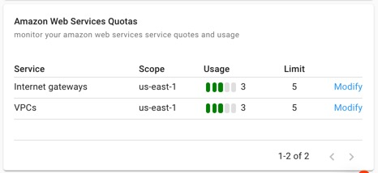

# AWS Quota Monitoring

Amazon Web Services maintains service limits on each AWS account to help guarantee the availability of AWS resources, as well as to minimize billing risks for the customers.


_You must have AWS Business or Enterprise Support in order to use this feature._ 


However, when you launch a new workload or need additional resources within the existing workloads, you may receive an error message similar to this one. 


_Note: This error is related to the AWS Elastic IP service limits but you may experience service limit error related to another AWS service._


For circumstances like these, we've added Service Limit and Quota Monitoring to the Cloud Management Platform. Once you [link an Amazon Web Services IAM Role](link-account.md) to the CMP with the requisite permissions for Quota Monitoring, you will receive automatic notifications whenever you hit the 80% threshold of your AWS service limits. 

## Setting up requisite permissions for Quota Monitoring


Read [this article](link-account.md) to see how to link your AWS IAM Role, and specifically [this section](https://help.doit-intl.com/amazon-web-services/add-your-amazon-web-services-iam-role#quota-monitoring) to see how to give the requisite permissions for AWS Quota Monitoring.


## Adding the Quotas widget to your dashboard

Once set up, you can add the 'Amazon Web Services Quotas' widget to any of your dashboards within the Cloud Management Platform. You will also start receiving the email notifications as you get close or reach the service limits. 

To do so, first go to the dashboard you'd like to add the widget to. Then, locate the 'Add Widgets' button in the lower-right corner of your screen and find the 'Amazon Web Services Quotas' option.

Finally, click on the widget option to add it as a widget to your dashboard.

To request a quota increase, click on the 'Modify' button and read the instructions provided by AWS in their [documentation](https://docs.aws.amazon.com/servicequotas/latest/userguide/request-quota-increase.html) of service quotas.  

### Monitored Services:

* Low Utilization Amazon EC2 Instance
* Idle Load Balancers
* Underutilized Amazon EBS Volume
* Unassociated Elastic IP Address
* Security Groups - Specific Port
* Security Groups - Unrestricted
* IAM Use
* Amazon S3 Bucket Permissions
* MFA on Root Account
* IAM Password Policy
* Amazon RDS Security Group Access
* Amazon EBS Snapshots
* Amazon EC2 Availability Zone Balance
* Load Balancer Optimization
* VPN Tunnel Redundancy
* High Utilization Amazon EC2 Instance
* Auto Scaling Group Resources
* Amazon RDS Backups
* Amazon RDS Multi-AZ
* Auto Scaling Group Health Check
* Amazon S3 Bucket Logging
* Amazon EBS Provisioned IOPS \(SSD\) Volume Attachment Configuration
* Large Number of Rules in an EC2
* Large Number of EC2 Security Group Rules Applied to an Instance
* Amazon RDS Idle DB Instances
* Amazon Route 53 Alias Resource Record Sets
* Amazon Route 53 Name Server Delegations
* Amazon Route 53 High TTL Resource Record Sets
* Overutilized Amazon EBS Magnetic Volumes
* CloudFront Content Delivery Optimization
* Amazon Route 53 Latency Resource Record Sets
* Amazon Route 53 MX Resource Record Sets and Sender Policy Framework
* Amazon Route 53 Failover Resource Record Sets
* Amazon Route 53 Deleted Health Checks
* AWS CloudTrail Logging
* ELB Listener Security
* ELB Security Groups
* ELB Cross-Zone Load Balancing
* ELB Connection Draining
* CloudFront Header Forwarding and Cache Hit Ratio
* CloudFront Custom SSL Certificates in the IAM Certificate Store
* CloudFront SSL Certificate on the Origin Server
* Amazon EC2 to EBS Throughput Optimization
* CloudFront Alternate Domain Names
* IAM Access Key Rotation
* Exposed Access Keys
* Underutilized Amazon Redshift Clusters
* Amazon EC2 Reserved Instance Lease Expiration
* Amazon S3 Bucket Versioning
* AWS Direct Connect Connection Redundancy
* AWS Direct Connect Location Redundancy
* AWS Direct Connect Virtual Interface Redundancy
* Amazon Aurora DB Instance Accessibility
* PV Driver Version for EC2 Windows Instances
* EC2Config Service for EC2 Windows Instances
* Amazon EBS Public Snapshots
* Amazon RDS Public Snapshots
* EC2 On-Demand Instances
* SES Daily Sending Quota
* EBS Provisioned IOPS \(SSD\) Volume Aggregate IOPS
* EBS Provisioned IOPS SSD \(io1\) Volume Storage
* EBS Active Volumes
* EBS Active Snapshots
* EBS General Purpose SSD \(gp2\) Volume Storage
* EBS Magnetic \(standard\) Volume Storage
* EC2 Elastic IP Addresses
* EC2 Reserved Instance Leases
* Kinesis Shards per Region
* CloudFormation Stacks
* Auto Scaling Launch Configurations
* Auto Scaling Groups
* VPC
* VPC Internet Gateways
* VPC Elastic IP Address
* IAM Instance Profiles
* IAM Roles
* IAM Policies
* IAM Users
* IAM Server Certificates
* IAM Group
* ELB Classic Load Balancers
* RDS Cluster Roles
* RDS Cluster Parameter Groups
* RDS Clusters
* RDS Reserved Instances
* RDS Subnets per Subnet Group
* RDS Subnet Groups
* RDS Option Groups
* RDS Event Subscriptions
* RDS DB Manual Snapshots
* RDS Total Storage Quota
* RDS DB Parameter Groups
* RDS Read Replicas per Master
* RDS DB Security Groups
* RDS DB Instances
* RDS Max Auths per Security Group
* EBS Throughput Optimized HDD \(st1\) Volume Storage
* EBS Cold HDD \(sc1\) Volume Storage
* DynamoDB Read Capacity
* DynamoDB Write Capacity
* Route 53 Max Health Checks
* Route 53 Hosted Zones
* Route 53 Reusable Delegation Sets
* Route 53 Traffic Policies
* Route 53 Traffic Policy Instances
* ENA Driver Version for EC2 Windows Instances
* NVMe Driver Version for EC2 Windows Instances
* Amazon EC2 Reserved Instances Optimization
* ELB Application Load Balancers
* ELB Network Load Balancers

