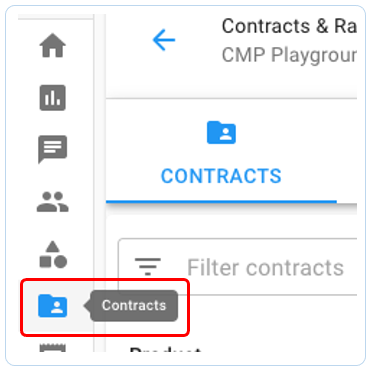
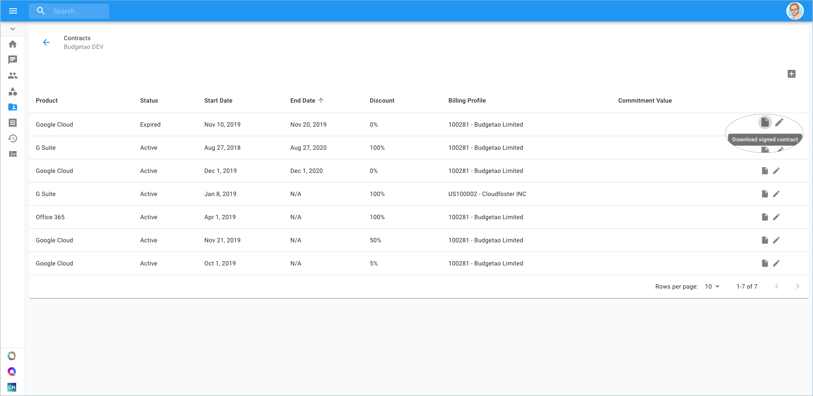

# Access Contracts

As a customer, you can access your company Contracts, including their full details and the actual contract documents. In order to access the Contracts section, go to the menu on the top left-hand side of the page and click on Contracts.


Required Permission: Contracts Viewer


You're now able to observe the details of the contract such as start and end dates, and in addition, access the original executed contract document.

