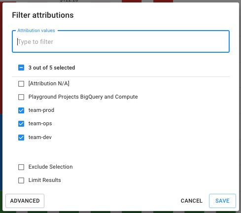

# Attribute Cloud Spend

Attributions are a flexible way to group resources and their associated costs, helping you understand the cloud costs and relate them to the business in your [Cloud Reports](https://help.doit-intl.com/hc/en-us/articles/360045644211-Creating-a-Cloud-Report).

You may have various components of your application(s) spread across different projects, using different services. Attributions allow you to combine everything into something coherent.


Required Permissions: **Cloud Analytics**


### Creating an Attribution

To create an attribution:

1. Click on the Cloud Analytics icon on the left hand navigation panel
2. Switch to the Attributions tab
3. Click the "**+ NEW ATTRIBUTION**" button

Next, you will be taken to an attribution creation page, where you will configure its conditions and settings.

To start, give your Attribution a name that gives some context. In our example, we'll be creating attributions to group costs for different teams: production, dev, and ops.

If you want to give even more context to your Attribution, you may give it a description by clicking on the icon at the far-right end of the text box.

Now it's time to configure the conditions, or the criteria, which will determine what falls under your Attribution. You have the option to either set as meet "**ALL**" or "**ANY**" of the conditions. This will switch between "AND" to "OR" relations.

You will have every cloud billing dimension to choose from; as well as any custom, project, and system labels. Select the field(s) you'd like to include as part of your Attribution from the dropdown:

From there, filter your selections either by keyword, exclusion, or regular expression just as you would do in Cloud Analytics Reports. Continuing our example from above, let's filter for projects which the production team uses.

Finally, click "Save" to apply the filter on your condition. 

Once you've set a condition, a quick preview will appear showing your attribution's costs over the last 30 days. This will continue to update as you add more conditions. This way, you can easily validate the conditions of your attribution.

Using our example from above, we will also create similar attributions for dev and ops teams.


You should **not** set multiple separate conditions with the same field — unless there is an exclusion set up in one of those conditions.


### Using Attributions in Cloud Analytics Reports

Finally, once an attribution is created, you'll be able to use it your Cloud Analytics Reports by  adding the Attributions chip to the break-out/group-by section, or by filtering them.

Note the "Attribution" chip in the group-by section for Report below:

In the event that you have many attributions, make sure to click on the Attribution chip to filter the ones you want to include in your report.

In the example above, we made sure to filter for the production, dev, and ops team attributions we created earlier.

View the bite-sized video below for a closer look at Attributions and using them in your Cloud Reports.



