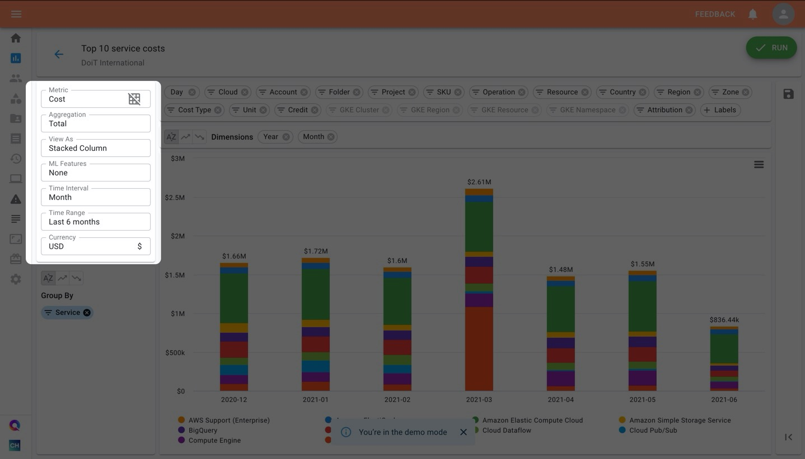
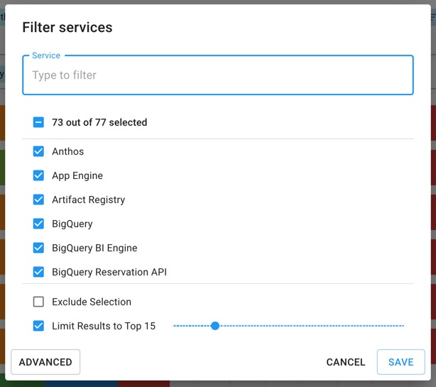
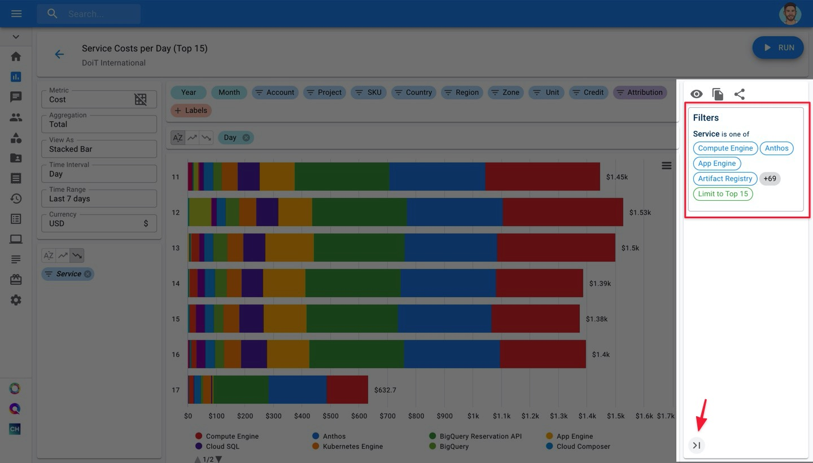
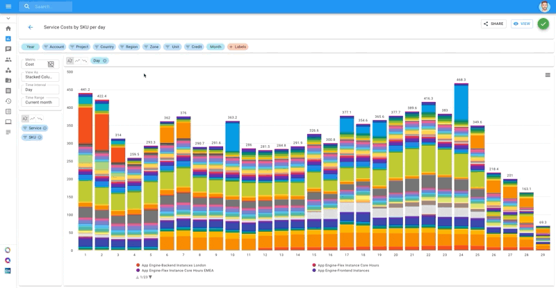

# Edit Cloud Analytics Report

**Note:** If you're new to Cloud Reports and/or haven't created a Cloud Report yet, we recommend reading our post on _[_**Creating Cloud Reports**_](create-cloud-report/)_ before reading further.

There are several types of edits you can make to your Cloud Report:

* Adding additional dimensions
* Changing the metric by which your dimensions are being measured
* Reordering results
* Changing the visualization
* Modifying the time interval and/or range
* Filtering dimensions

Most of these are self-explanatory, as you would simply make your changes the same way you made your original selection.

Let's briefly go over your options for editing reports, highlighted below.

## Report Settings

### Metrics

**Cost:** Analyze your reports on a basis of how much your selected dimensions cost you.

**Usage**: Analyze your reports and selected dimensions on a usage basis. Make sure to pair this with the Unit chip as a Breakdown Dimension.

**Savings:** Analyze your reports and selected dimensions on a savings basis. These savings come as a result of your commercial agreement with Google Cloud and the agreed-upon discount between your company and DoiT International.


The discount is not available for the following services: Google Maps APIs, Google Support, Looker, Preemptible VMs (compute engine), 3rd party GCP Marketplace services, Premium OS Images.


### Aggregation

Use aggregations to summarize how you view your reports. [Read more on aggregations](https://help.doit-intl.com/cloud-analytics/using-aggregations-in-cloud-reports).

### View As

This is where you select how your report is visualized.

### ML Features

Use this to perform advanced analysis in your reports with just a click. Use this to perform [Trend Analysis](https://help.doit-intl.com/cloud-analytics/trend-analysis) or to [create Forecasts](https://help.doit-intl.com/cloud-analytics/forecasting) is supported.

### Time Interval & Time range

Specify the frequency in which data is aggregated. For the time interval, you have the following options: Hour, Day, Week, Month, Quarter, Year.

For the time range, the options are the following:

.png>)

### Currency

Currency that the billing data is reported in (Metric must be "Cost").

### Compare Data

The **Compare Data** toggle will automatically add %change between 2 time intervals in a report.

Comparison mode is

* Only supported on _Table_ based views.
* Only supported with _Total Aggregation_
* Must be used on _Time series data_

When selected _**we will automatically adjust your report**_, you will be warned of the changes and asked to confirm.

.png>)

Once enabled, you will see new columns in your table based view showing the ∆
between time intervals.  This difference (∆) appears **after** the intervals
compared.

For example below: Months 07 (July) and 08 (August) show the % change after in the column ∆08 (Change to August)

.png>)

### Filtering Dimension Values

To view a subset of your dimension's values, click on the chip you'd like to filter. Then check the boxes next to the subsets you'd like to view in the report.

You may also exclude a selection of values, or limit results to a specific number of values arranged in descending order according to the Metric (Cost**,** Usage, or Savings) selected.

Next, click "Save" in the lower-right corner of the popup modal.

Your filters are displayed along with any other visible configurations on the right-hand collapsable sidebar. To expand it, click on the **>|** icon in the lower-right corner of your screen.

Finally, click the "Run" button to generate an updated report that reflects the filters you've selected.

## Performing Edits

Depending on the edits you're making to your Cloud Report, you may have to re-run your report for the changes to reflect while other edits will show up in real-time.

### Real-time updates

Any edits which don't alter the results themselves will update the report in real-time. This includes changes made to:

* Metric measurement
* Chart type
* Sorting of results
* ML Features such as [Trend Analysis](trend-analysis.md) or [Forecasting](forecasting.md)

Below, we can see the first three types of real-time edits being performed.

## Edits requiring a refresh

Updates made to reports which require you to refresh it include:

* Adding additional dimensions
* Modifying the time interval and/or range
* Filtering dimensions

Below, you'll see what it looks like to filter a dimension.

