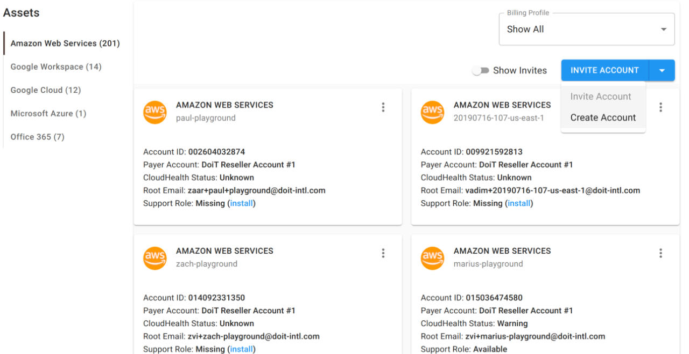
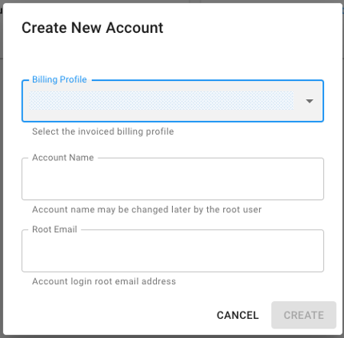
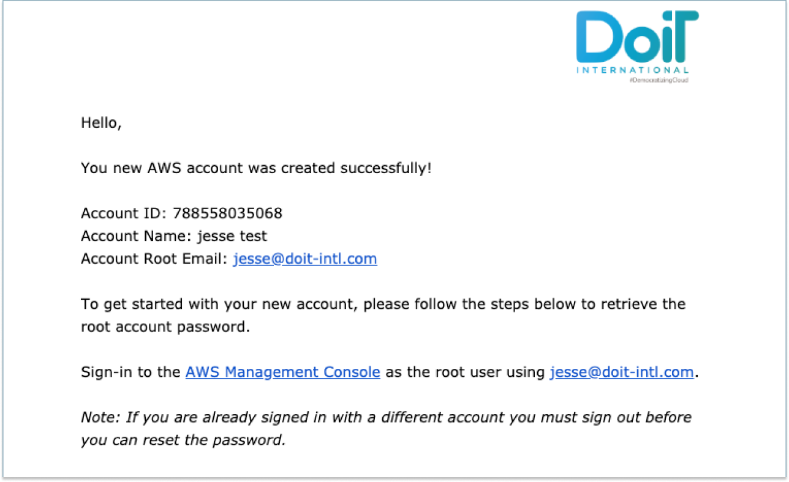

# Create An AWS Account

As a customer, you can create a new AWS account directly from the Cloud Management Platform.


Please note you must be assigned access to the specific Billing Profile under which the domain is managed in order to create a new account.



You will see an **OrganizationAccountAccessRole** in the new AWS account. This role is created by AWS and links back to the parent account. When creating the account we will use this role to [create the CloudHealth IAM Role](https://help.doit-intl.com/amazon-web-services/set-up-cloudhealth). The CMP or DoiT International will not use this role afterwards and you will have to **manually remove this role from your account**


* Log into the [Cloud Management Platform](https://app.doit-intl.com)
* Click on the "setting" ⚙ icon located at the top right side of the navigation bar
* Click on "assets" under "cloud settings"&#x20;
* Once you're at the Assets page, go to the right-hand side of the page and click on '**Invite Account**'.

On the right-hand side of the page, click the bottom facing arrow and choosing 'Create Account'.

Choose the Billing Profile to which you're creating the account for while choosing the name of the account to which the _root email_ is associated with.

Click 'Create' and a popup will appear that the account was created successfully.

As listed in the popup, an email is sent out for further instructions, here is an example.

The following video shows you how to create an AWS Account.



If you require further assistance please contact our support team at [support.doit-intl.com](https://support.doit-intl.com)
