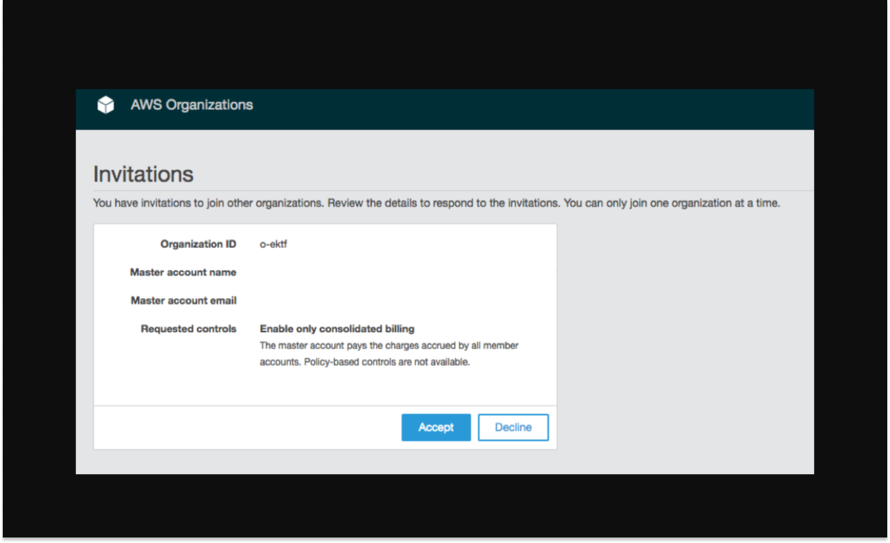
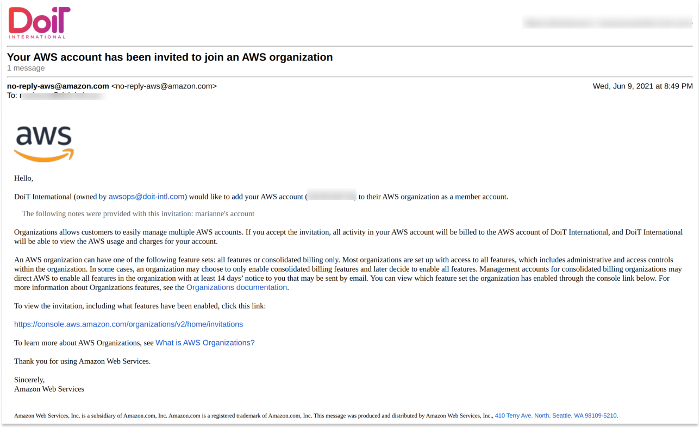
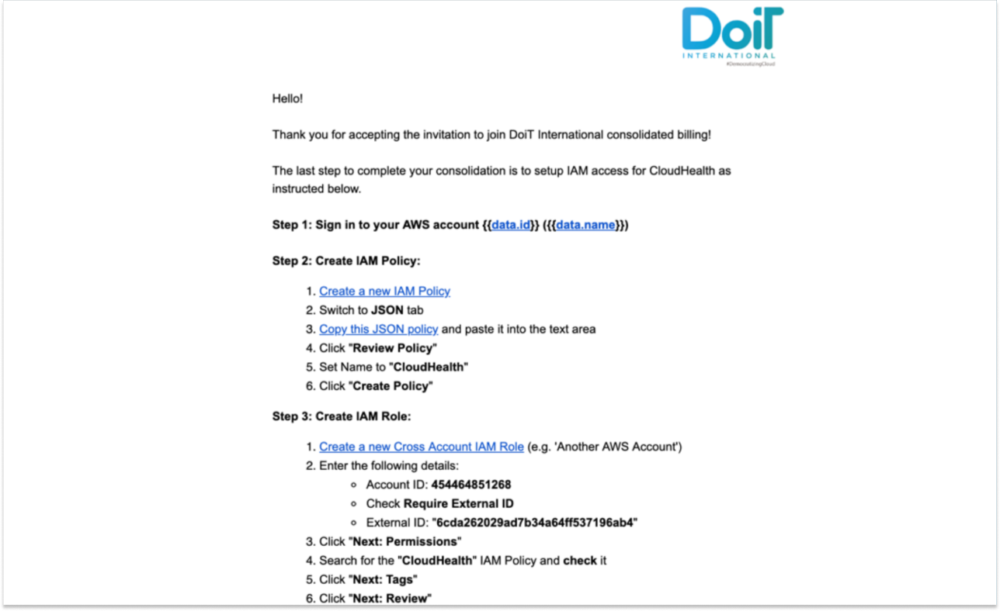
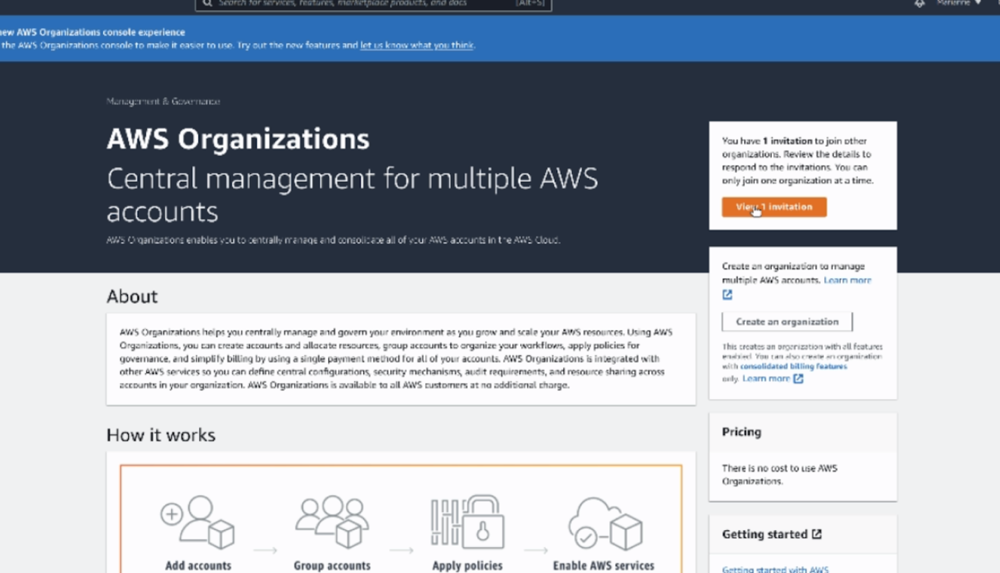

# Invite Existing AWS Account

You can add existing AWS accounts to DoiT International's consolidated billing using the Cloud Management Platform.


Required Permission: **Licenses Manager**



Please note that you must be assigned access to the specific Billing Profile under which the domain is managed in order to invite an existing account.


1. Log into the [Cloud Management Platform](https://app.doit-intl.com)
2. Click on the "setting" ⚙ icon located at the top right side of the navigation bar
3. Click on "assets" under "cloud settings"
4. Once you're at the Assets page, go to the right-hand side of the page and click on '**Invite Account**'.

Choose the Billing Profile to which you'd like to have the existing AWS account now be a part of. Enter the 12-digit AWS Account ID and any optional notes before clicking 'Invite'.

An email will be sent on behalf of AWS.

If within five minutes you haven't received the above email, please re-enter your AWS Account ID in the DoiT Cloud Management Platform and invite once again.

To complete the process, sign in to the [AWS Organizations Console](https://console.aws.amazon.com/organizations/). On the Invitations page in the console, you can see your open invitations to join organizations. Finally, click the "Accept" button to accept the invitation.

Afterward, you will be redirected to the **Organization overview** page with details about the organization that your account is now a member of. You can view the organization's ID and the owner's email address.

## Multiple Accounts Under a Master Organization

In the event that you have multiple accounts under a Master account / organization, you will get an error trying to accept the invitation.

In order to successfully accept the invitation, you must remove each linked AWS account from your master account.


Note: This will prompt you to input payment details for each linked account if you didn't do so while initially creating them.


For each account you must:

1. "Leave" the Organization (no new invites will appear before you do this)
2. Accept the invite from DoiT International in each linked account

## Completing IAM Access for CloudHealth

After signing in to the AWS Console and accepting the invitation, a final email will be sent instructing how to complete the IAM access for CloudHealth.

## Frequently asked questions

### I’ve performed all the requested steps, I have spends on my AWS billing account, but my information is still not there. What could be the reason ?

Once successfully completed it takes 24-72 hours for the data to start flowing through from AWS, then our Cloud Management Platform will update.

### I have not received any invitation email. What could have gone wrong?

On your organization's page, check if you can see the invite:

If you can't see that invite, check if you have left your organization as specified in the above "Multiple Accounts Under a Master Organization" steps.

If you can see the invite on the organization's page, consider the following:

Is the invite in your spam folder? Did you enter the correct AWS account id when inviting the account?

If you are still having issues, you can [open a support ticket](https://hello.doit-intl.com/support).

### My CloudHealth status shows as "critical" or "unknown", what does it mean?

### My payer account is showing as N/A, what does that mean?

 (1).png>)

It means that your Cloudhealth configuration was not done properly.

**Actions to take:** please [open a support ticket](https://hello.doit-intl.com/support) if you see the CloudHealth status as "critical" or "unknown", or if you see Payer Account: N/A.

**The consequences are the following:**

* Our Cloud Management Platform is not able to properly reflect your reservation data, and you cannot use the FlexSave and Spot Scaling services.
* It also means you will not be able to run reports on this asset, the reason being that the data is not flowing to our platform.
