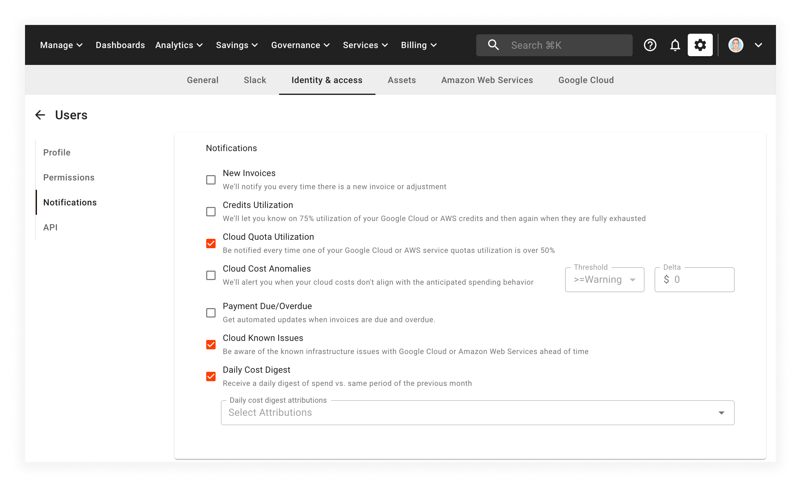

# View Cost Anomalies

Cloud cost anomaly detection offers end-to-end monitoring of spikes in your Google Cloud or Amazon Web Services billing, seamlessly, across all your projects and services.

At the core of our cost anomaly detection service is our machine-learning algorithm. It works by monitoring billing data and analyzing the trend of spending in your environment. In addition, the machine learning model identifies billing patterns across many customers, forecasting your cloud spending, and constantly improving itself to provide even more accurate results.

Essentially, billing records that don't align with your anticipated spending behavior are identified for its deviation from the established patterns. You can also get insights into which resources are causing the anomalies and take corrective actions. Our anomaly detection engine is always running, however, you can opt to get email notifications, to get near-real-time email alerts on detected anomalies.

## Manage anomaly notifications

To manage your notifications, select the _Settings_ icon (a gear) from the top menu, then select _Identity and access_.

On this screen, select your own user account.

Then, on your user profile page, select _Notifications_ from the left-hand menu:

If you'd like to be notified of potential anomalies, check the _Cloud Cost Anomalies_ box and then set the minimum severity threshold you'd like to be alerted on.

By default, the threshold for email alerts is set to _Warning_. You can modify this value to increase or decrease the number of alerts you receive.

## View anomalies

We store all detected cost anomalies, so you can always access them by selecting _Governance_ from the top menu bar, then selecting _Cost anomalies_ (see below).

## Investigate anomalies further

If you'd like to dive deeper into an anomaly, select the _INVESTIGATE_ button in the top right-hand corner of the screen to launch a pre-configured Cloud Analytics Report. This feature allows you to zoom in on a specific anomaly and determine what any action (if any) is needed.

## Fine-tune alerts with direct feedback

To reduce the number of false alerts, you can provide a thumbs-up or a thumbs-down for each alert. We use this information to fine-tune our anomaly detection algorithm and improve results.

## Anomalies Widget

View the bite-sized video below for a closer look at anomaly detection:


