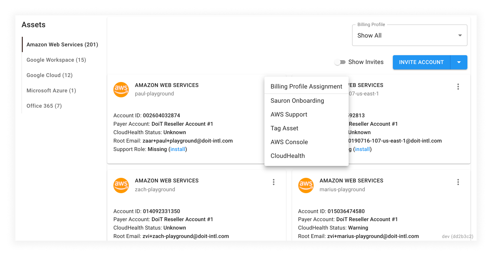
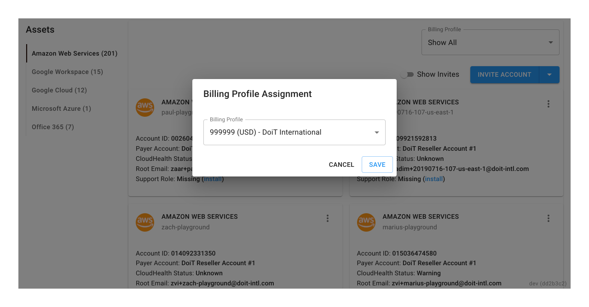

# Assign Assets to Billing Profiles

You can assign assets to [Billing Profiles](../invoices-and-payments/setting-up-a-new-billing-profile.md) for invoicing purposes. Since every Billing Profile receives its own monthly invoice, how you assign assets will affect how each entity is billed.


Required Role\*\*: Admin\*\*


Navigate to 'Assets' via the settings cog in the top-right hand section of the main navigation

Once you're on the Assets tab, switch to the relevant 'Asset Type' you want to work with (AWS, Google Cloud, etc), locate the 3-dot menu on the chosen asset card, and click on 'Billing Profile Assignment'.

Finally, select the Billing Profile you'd like to assign the asset to from the dropdown, and click "Save" to confirm your changes.

