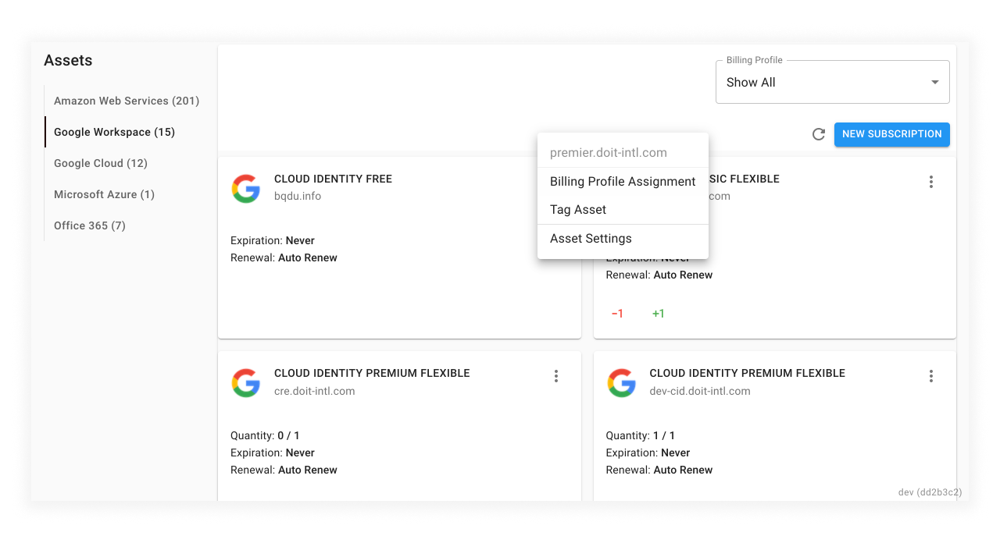
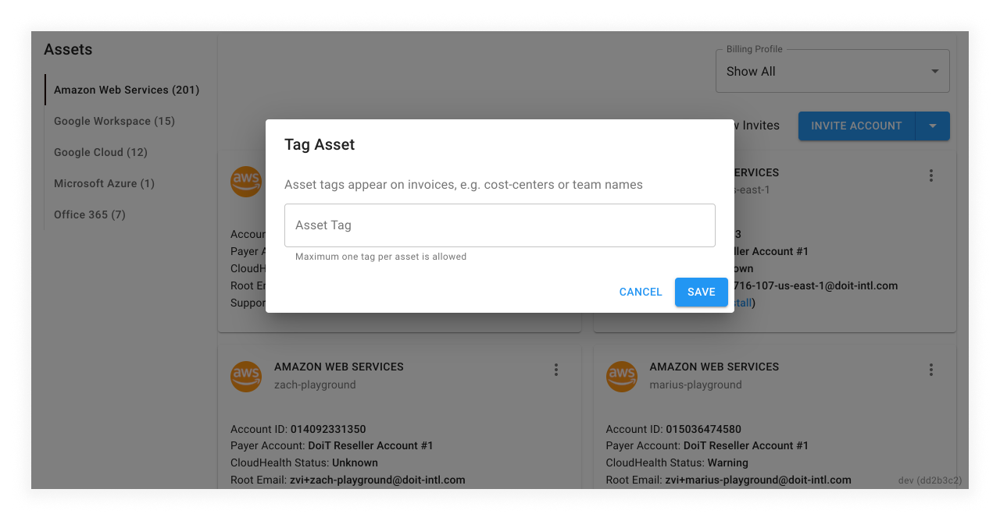

# Tag Assets

Assets in DoiT Cloud Management Platform (CMP) refer to your Billing Accounts for Google Cloud, Accounts for AWS, or Subscriptions for Google Workspace, Microsoft Azure, or Office.

You can tag an asset for classification purposes. Tags will appear on invoices so you will be able to identify invoice items easier. The best practice is to tag assets with a term or keyword like team name, cost center, location, or any tagging convention used in your organization.

Note that only one tag is allowed per asset. To add tags to assets, see the following instructions.


Required Role\*\*: Admin\*\*


1. Navigate to 'Assets' via the settings cog in the top-right hand section of the main navigation
2. Within the 'Assets' section, select the 'Asset Type' you want to tag (AWS, Google Cloud, etc.)
3. Once on the chosen tab, click the 3-dot menu of the asset you wish to tag
   * The assets are shown as cards
4. Select 'Tag Asset'
5. Input a new tag or select from the list of previously created tags
6. Click 'Save'

All new tags you save will be added to the tag selection list and will be available to use for other assets.

After clicking save, the tag will be visible under the asset name in the form of a grey chip.
