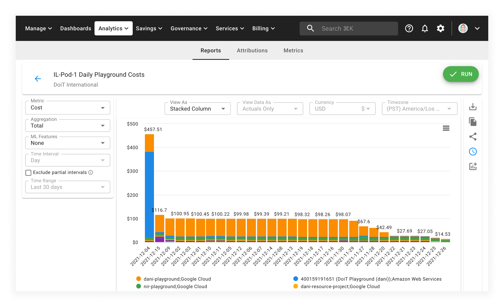
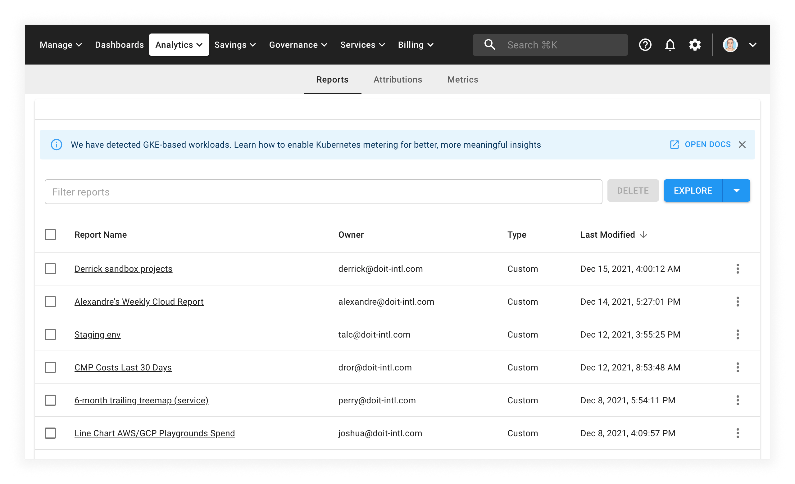

# Schedule Report Email Delivery

You can send a copy of your Cloud Analytics report to yourself and your stakeholders on a regular basis by setting up an email delivery schedule.


Required Permissions: **Cloud Analytics**


## Create a scheduled email delivery

There are two ways to schedule emailed reports:

* Via a specific Report's page
* Via the main Cloud Analytics page

### Scheduling via a report s page

Begin by opening a report that you have "Owner" access to. Then, click on the clock icon on the right-hand menu bar:

Then, configure the scheduled delivery:

* Set other users, you'd like to be included on report's distribution
* Optionally, update email's subject and the message to provide more context for recipients
* Set up when you'd like to be delivered (using [_cron expression_](https://crontab.guru))

If you've included someone who doesn't have access to the report, you will be asked to add that user to the report. You can choose whether to grant the "Viewer" or "Editor" access.

 (1).png>)

## About Cron expressions

The delivery time and recurrence of a Cloud Analytics Report can be configured by using a [cron expression](https://wikipedia.org/wiki/Cron#CRON\_expression). Cron is a time-based job scheduler originally used in Unix-like computer operating systems. A cron expression is a string comprising of five or six fields separated by whitespace. The following table defines the fields of a cron expression and the possible values for each field.

| Minute | Hour | Day  | Month                                                                                                                               | Day of the week                                                                                                                         |
| ------ | ---- | ---- | ----------------------------------------------------------------------------------------------------------------------------------- | --------------------------------------------------------------------------------------------------------------------------------------- |
| 0-59   | 0-23 | 1-31 | 
1-12 (Jan-Dec)  <code>1</code>=<code>Jan</code>, <code>2</code>=<code>Feb</code>, ... <code>12</code>=<code>Dec</code>
 | 
0-6 (Sun-Sat)  where <code>0</code>=<code>Sun</code>, <code>1</code>=<code>Mon</code>, ... <code>6</code>=<code>Sat</code>
 |

In addition to using these values, every field in a cron expression can also use special characters:

| Character | Meaning | Example                                                                                                                                               |
| --------- | ------- | ----------------------------------------------------------------------------------------------------------------------------------------------------- |
| `*`       | any     | If the day of month field, day of the week field are each set to `*`, then the schedule starts every day.                                             |
| `-`       | range   | If the day of week field is set to `1-5` or `Mon-Fri`, then the schedule starts every week Monday to Friday.                                          |
| `,`       | list    | If the month field is set to `5,7,9` or `May,Jul,Sep`, then the schedule starts every May, July, and September.                                       |
| `/`       | step    | If the month field is set to `*/3`, then the schedule starts during the first month and every 3 months after that: January, April, July, and October. |


Schedule intervals lower than daily are not permitted with Cloud Analytics, meaning the first 2 places must be numbers between (0-59) and (0-23)


To create a schedule that repeats, use special characters to describe when that schedule is to repeat. For example, the cron expression 30 8 \* \* Mon-Fri configures a schedule to start at 8:30 AM on every Monday, Tuesday, Wednesday, Thursday, and Friday.

Your scheduled report will look something like the image below. From the email, you'll be able to preview the report and open an interactive report in Cloud Analytics, by using the "Open Live Report" button.

Select the access level you'd like to give them, and click "Add" to give them access to the report and add them to the list of scheduled report recipients.

Your scheduled report will look something like the image below. From the email, you'll be able to preview the report and open an interactive report in Cloud Analytics, by using the "Open Live Report" button.

Your scheduled report will look something like in the example below. From the email, you'll be able to preview the report and open an interactive report in Cloud Analytics, by using the "Open Live Report" button.

### Scheduling via the Cloud Analytics page

You may also schedule emailed reports from the main Cloud Analytics page.

First, find a report that you are the owner of. Then, select the horizontal ellipsis icon in the right-most table column, and select _Email Schedule_ from the drop-down menu.

From there, configure your report as described above, modifying the message and interval as well as the recipients.

## Updating scheduled delivery

To update the scheduled email delivery configuration, open a report that has a configured schedule and select the blue clock, like before.

You may can also update a report's email delivery schedule directly from the Cloud Analytics screen by selecting the horizontal ellipsis, like before.

## Subscribing to other people's scheduled deliveries

Using the same methods as above, you can also subscribe to other people's scheduled deliveries.

### Deleting scheduled delivery

If you need to delete the scheduled report, please use the Delete button on the "Schedule Report Email Delivery" dialog.

## Limitations

A few limitations exist for scheduled reports:

* Each report can only have a single email delivery schedule
* Preset reports cannot be scheduled. You can [clone](cloning-and-or-customizing-cloud-reports.md#clone-reports) the report though and schedule it.
* The person who scheduled the report is always included in the email
* You can't schedule a report to be delivered more than once a day.
* Only chart-based reports can be scheduled (i.e. no tables or heatmaps at this time)
