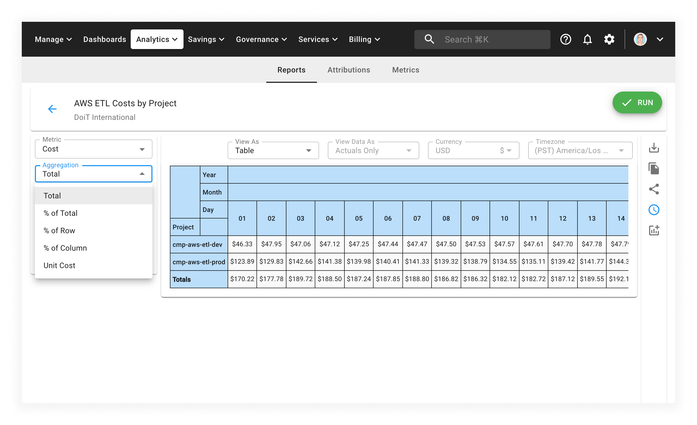
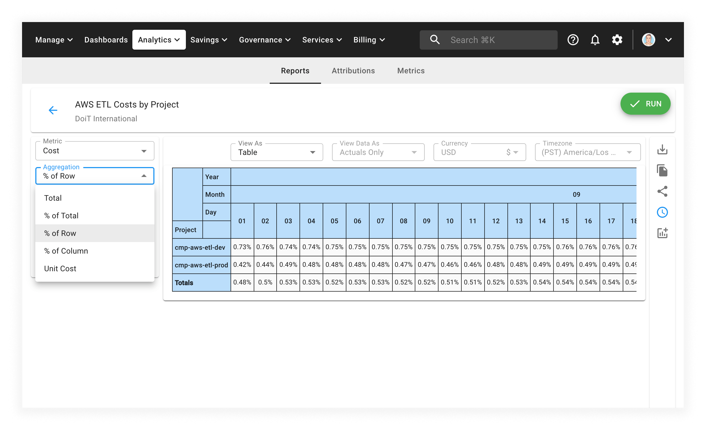

# Understanding Aggregations

Before you can properly control and optimize your Google Cloud costs, you need to understand where costs originated within your organization. Aggregations in Cloud Reports help you summarize patterns so you can more quickly identify the source of potential issues.

In this article, we'll go over the types of aggregation options you have available in Cloud Reports. For consistency's sake, we'll be showing how each aggregation looks in a Table view. However, these aggregations can also be useful in other Chart types and may behave differently as a result.

## Total

In the "Total" aggregation, your results will be displayed in absolute terms. A row and column, each titled "Totals", will be added at the end containing the sum of all of the results per row and column, respectively.

## % of Total

"% of Total" aggregations express each result as a percentage of the total sum of results. All values of the cell will add up to 100%.

If you're viewing your results in a Table view, then a final column titled "Totals" will be added at the end containing the sum of all of the results per row, expressed as a percentage.

## % of Column

"% of Column" aggregations display cell values as a percentage of its column, with each column being represented as 100% in totality.

## % of Row

"% of Row" aggregations display cell values as a percentage of its row, with each row being represented as 100% in totality.

## Cost÷Usage

"Cost÷Usage" aggregations are great for use cases requiring cost-per-unit pricing validation. In the example below, we are using this aggregation to examine BigQuery SKU costs per project.

