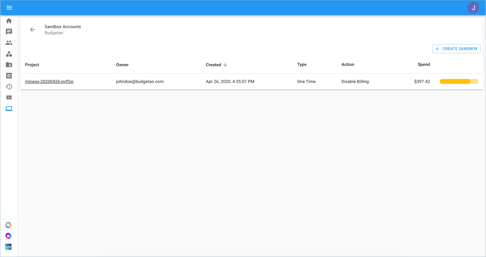
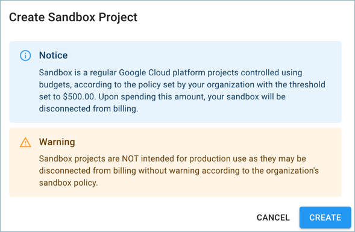
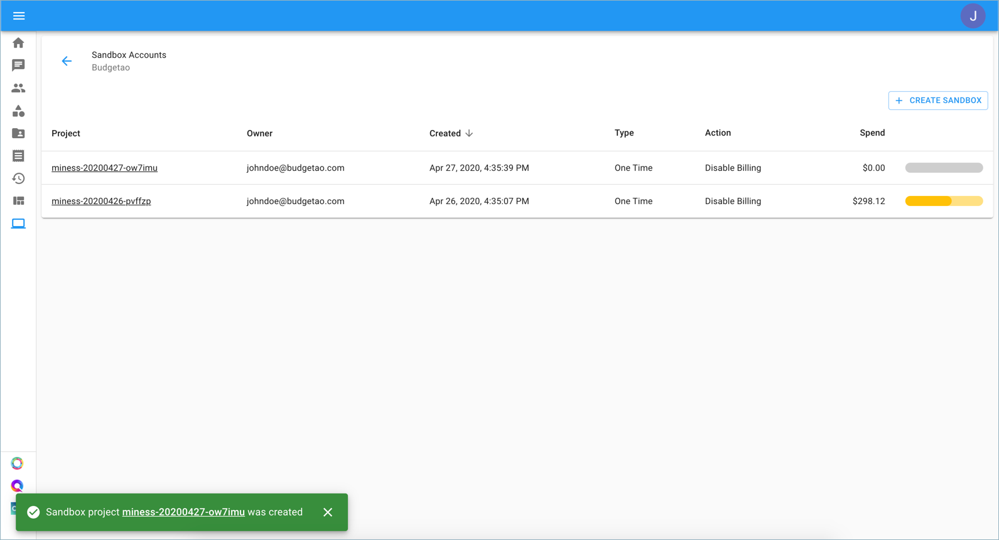

# Creating Google Cloud Sandbox

Google Cloud Sandbox for Organizations is the easiest way for companies to set up and manage Google Cloud sandbox accounts. Through the Cloud Management Platform, you’ll be able to create a sandbox and monitor budget utilization.


Required Permission: **Sandbox User**


After a [policy has been configured](configuring-a-policy-for-sandbox-accounts.md), a user can create sandbox accounts up to the amount which was defined by the Admin in the Sandbox Policy.

From the home page, please select 'Sandbox Accounts' using the left navigation menu. Then, click on 'Create Sandbox', located on the right-hand side of the page.

A notification will pop up informing you of the policy set by your organization (Sandbox Admin) and the budget amount that applies. Click on 'Create' to proceed.

Once created, you will see your new sandbox project on the list.

To use the sandbox, click on the sandbox name. It will open the Google Cloud Console home page and preselect the created Google Cloud project for you.

When and if your sandbox project's budget has surpassed the set threshold, and if the 'End of Budget Action' in the Sandbox Policy is set to 'Disable Billing', your sandbox project will be disconnected from the billing account. When the billing is disabled for a protracted period, some resources might be removed by Google from the projects associated with that account. For example, if you use Google Cloud, your Compute Engine resources might be removed. Removed resources are not recoverable.

If the 'End of Budget Action' in the Sandbox Policy is set to 'Email Alert', an email notification will be sent out informing you of the status.
