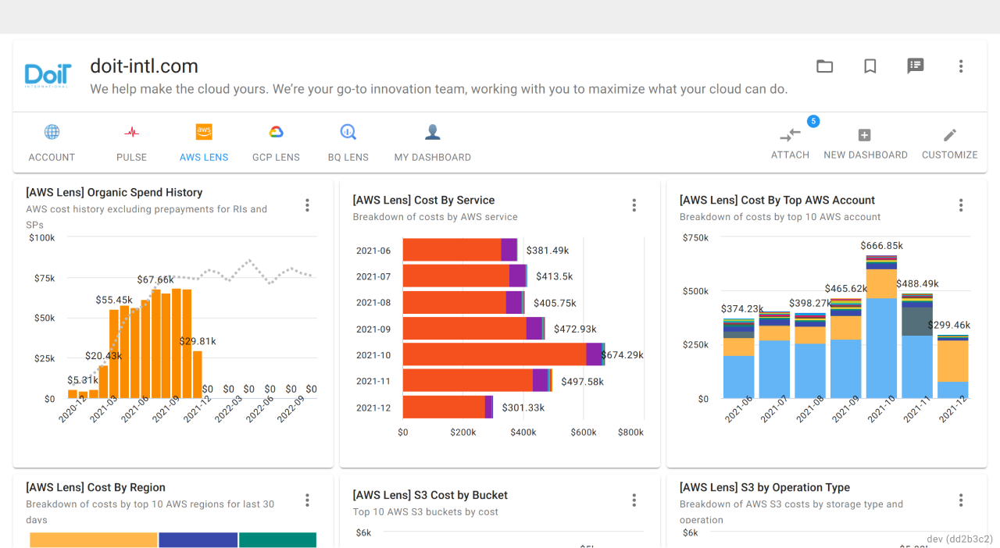
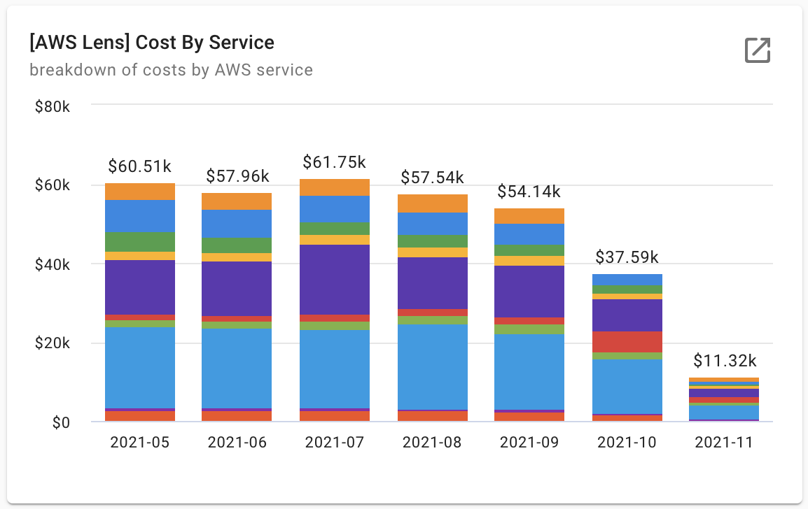
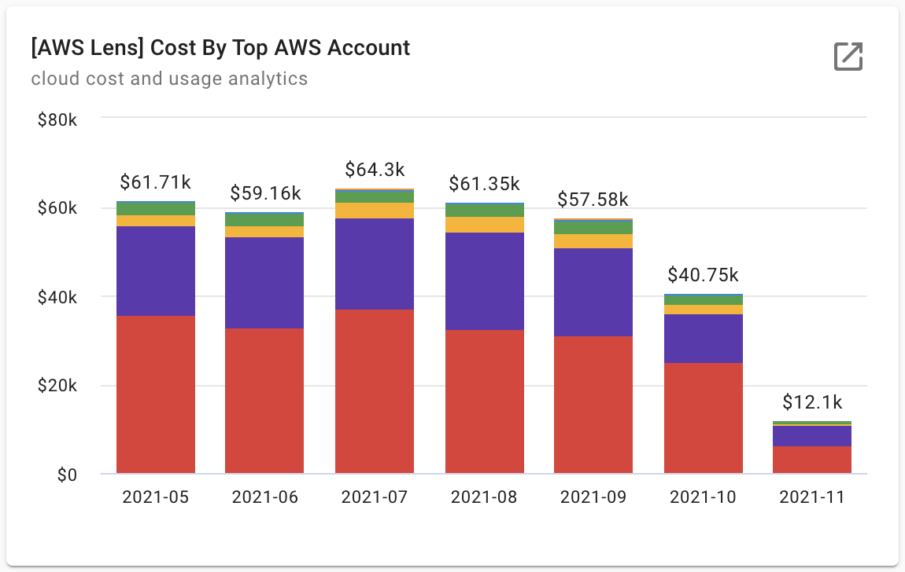
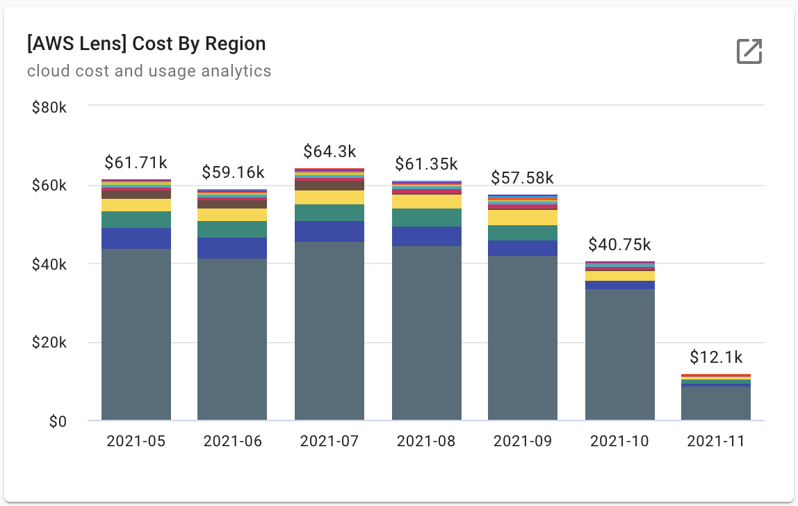
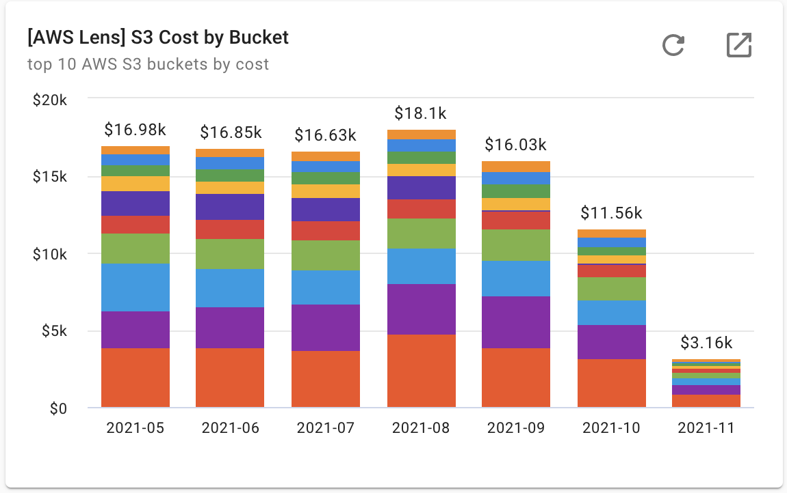
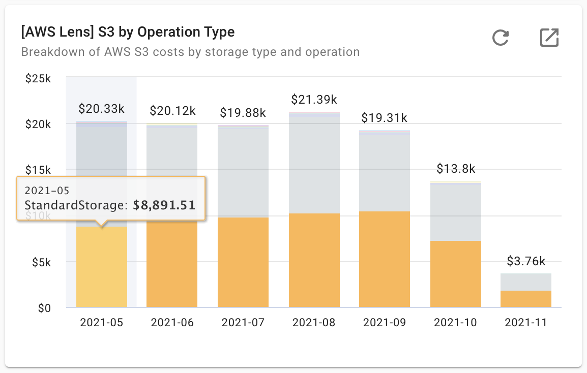
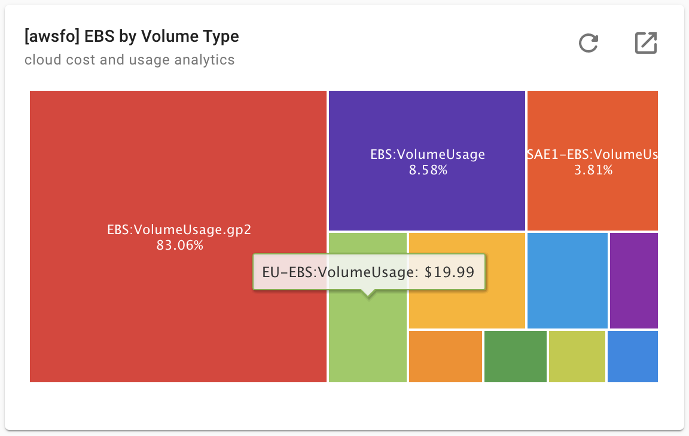

# AWS Lens

Having full visibility into your services' operations and being accountable for your cloud finances to fully manage costs is crucial, whether fixed or variable. Use this dashboard to decide how and when to optimize costs, monitor performance, and more. The AWS Lens dashboard will show up if you have Amazon Web Services accounts.

From the list of dashboards, select '**AWS Lens**' to access the dashboard. Each of the preset widgets serves its own purpose (see below):

**Cost By Service** - Review your AWS expenses over the last 6 months. The costs are broke down by top ten AWS services you use across all your AWS accounts.

**Cost By Top AWS Accounts** - Helps you to review the AWS costs you're using by AWS account/s you have in your organization

**Cost By Region** - Focus on Amazon Web Services costs by AWS region. Look out for unrecognized regions to avoid unexpected costs.

**S3 Cost by Bucket** - Focus on how your application uses AWS Simple Storage System (S3), and monitor your costs with a breakdown by bucket name.

**S3 by Operation Type** - Review your Simple Storage System (S3) costs the storage tier you're using

**EBS by Volume Type** - Gain insights on how your application uses the Elastic Block Storage (EBS) with a breakdown by storage type

