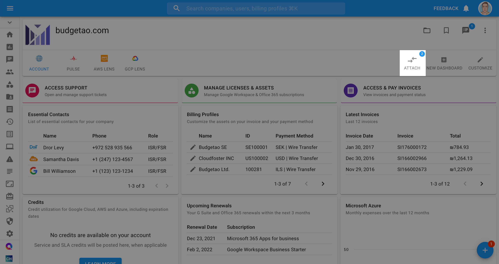

# BigQuery Lens

## Overview

BigQuery Lens is your Swiss army knife for highlighting inefficiencies in your organization's BigQuery usage, and its insights are displayed in the **BigQuery Lens**, located in your [Cloud Management Platform](../). Without configuring anything, you'll have the most important BigQuery insights brought _to_ you.


To access the BigQuery Lens, you must verify that your Google Cloud service account was successfully uploaded and granted the appropriate permissions. Read more on [linking your Google Cloud Organization](../google-cloud/connect-google-cloud-service-account.md).=


If successfully uploaded, you will see:

* Either a _HEALTHY_ or _PARTIAL_ value underneath the _Status_ column in your _Configured Accounts_ widget, and
* _HEALTHY_ status next to _BigQuery Lens_ in the _Features_ widget.
* _HEALTHY_ status next to _BigQuery Lens Advanced_ in the _Features_ widget (**Optional**)

## Setup

Once the Google Cloud Service Account setup is complete, click the _Attach_ button and choose the BigQuery Lens from the list.

The CMP will now start gathering the information on your usage patterns.


**The BigQuery historical jobs are backfilled for the last 30 days**


While this information is being collected, your BigQuery Lens will have the three following states:

1. You will see the following message displayed at the top of your screen:\
   \
   _`We have started to analyze your historical usage. So far, we have processed X%. In the meantime, you can explore our training`_[_`Perks`_](../perks/perks.md)_`!`_\
   _``_
2. Then, the message will change to: \
   \
   `The scan is completed, and X% of your data was already processed. You are almost there!`\

3. Finally, once the BigQuery Lens is activated, the message at the top will change to:\
   \
   `BigQuery Lens highlights inefficiencies in your BigQuery usage. The analysis represents the last 30 days of use.`

Once available, you'll see the BigQuery Lens populated with the statistics around your organization's BigQuery usage, and some recommendations.

## Understanding the BigQuery Lens

The BigQuery Lens is made up of widgets that will provide you more insight into your organization's statistics.

### Elements of the Dashboard

Below is a list of the elements that make up the BigQuery Lens, corresponding to the numbers in the image above.

1. **Time range and Usage type dropdowns**
   * **Time range** adjusts the timeframe of the data you're looking at, and has options of _Last 30 days_, _Last 7 days_, or _Last day_
   * **Usage type** determines which BigQuery projects you're looking at, based on the pricing model you're using to pay for them, and has options of _On demand_ or _Flat-rate_
2. **Recommendations** - comprehensive recommendations with further details on how to act on each recommendation.
3. **BigQuery Explorer** - get more granular information as far as your team's BigQuery usage, completely modifiable by the user in the following format:

* For "On-demand" usage type: (**Project, Billing Project, Dataset, Table, User**) by (**Scan Price, Scan TB)**
* For "Flat-rate" usage type: (**Project, Billing Project, Dataset, Table, User**) by (**Average Slots**)\
  \
  Clicking on one of the results in the BigQuery Usage Explorer widget will open a pop-up where you can get even more granular with your usage insights.

4\. **Slots Consumption** - The number of slots consumed by your organization — in terms of _Peak usage_ and _Average usage_ — by _Day_ or _Hour_

5\. **BigQuery Scans by Table Type** - see how much data you are scanning from various types of tables, broken down between unpartitioned tables and various types of partitioned tables, along with external sources (e.g., _Google Sheets_).

You can drill down into this report by selecting any of the types to see the most frequently scanned tables of that type.

6\. **BigQuery Spend by SKU** - BigQuery costs broken down per SKU.\
\
You can a view a complete report with many additional configuration options by selecting the _View more_ button in the top right-hand corner of the widget.

### BigQuery Recommendation Types

Below is a list of the recommendation categories you'll see in the BigQuery Recommendations widget, and how to use the information contained within each recommendation. Depending on the "Usage type" selected, you'll see a different list of recommendations.

#### On-demand usage type recommendations

**Backup and remove unused tables** - Backup and remove the unused tables listed under the "Table" column. If the table has multiple partitions, click on the number listed under "Partition(s) to Remove" to see precisely which partitions should be removed.

**Cluster your tables** - Cluster the tables listed under the "Table" column by the field(s) suggested under the "Cluster By" column.

**Enforce Partition Fields** - Use the suggested partitioned fields(s) under the "Partition Field" column for the corresponding queries listed under the "Query ID" column.

**Partition your tables** - Partition the tables listed under the "Table" column by the suggested field(s) listed under the "Partition Fields" column.

**Limit query jobs** - Reduce job execution frequency of the listed jobs under the "Query ID" column by the percentage you choose on the slider, and view the associated savings of each reduced job under the "Savings by Reducing Jobs" column.

**Switch to monthly flat-rate plan** - Purchase the slots amount listed in the "Optimal slots amount" column to reduce your BigQuery spend&#x20;

#### Flat-rate usage type recommendations

**Move repeating queries to a different time slot** - Lower your minimum average slots requirements by moving the recurring queries below to a less-busy hour of the day. To identify suitable hour(s), review the "BigQuery Slots Consumption" widget with the interval set to “Hour”. Troughs in your daily slots consumption represent optimal hours to run recurring queries.

**Backup and remove unused tables**

## BigQuery Lens Frequently Asked Questions (FAQ)

Oftentimes we get asked what the non-read-only permissions are for, and so we'd like to share more about how it plays into the process of creating your BigQuery Lens.

### What write permissions needed for the BigQuery Lens?

We need the following write permissions for the standard BigQuery Lens:

* `bigquery.datasets.create`
* `logging.sinks.create`
* `bigquery.jobs.create`

For BigQuery Lens Advanced, we need the following write permission:

* `bigquery.tables.getData`

### Why do you separate between BigQuery Lens and BigQuery Lens Advanced permissions?

We require `bigquery.tables.getData` in order to provide clustering recommendations, and this is separated from the permissions required under the BigQuery Lens feature.

This allows us to query your BigQuery tables and determine your top 20 non-clustered tables, which field(s) are the best candidates to cluster those tables by, and in what order.

More specifically, this helps us identify the cardinality of the columns in your top 20 non-clustered table referenced in the `WHERE` clause (i.e., the columns which can be clustered on). Knowing how many distinct elements exist in each column enables us to compute the average chunk size and determine the best savings candidates.

However, you can still use and benefit from BigQuery Lens without receiving clustering recommendations. That's why we separate the two.


BigQuery Lens Advanced provides recommendations based on the presumption that:

* You will will continue to execute similar queries as you did during the previous 30 day period, and
* You will reference fields _in the order that we recommend_


### What datasets are you creating, where and for what purpose?

A dataset called `doitintl-cmp-bq` is created in the billing project attached to the service account you add to the CMP.

### What log sinks are you creating, where and for what purpose?

A sink for query jobs is created in the same project as above. This sink pushes all your bigquery jobs into a table under `<PROJECTID>.doitintl-cmp-bq` `cl oudaudit_googleapis_com_data_access`.

### What queries will you be running, where, and for what purpose?

We have two main processes, one of which runs queries and the other which runs the enrichment process:

1. We take the data from `doitintl-cmp-bq.cloudaudit_ googleapis_com_data_access` and create a new table `doitintl-cmp-bq.enrichedJobs`. This operation is done at no cost to you. We do this to perform the following enrichment process so that we have a clean dataset to work with.
2.  For the BigQuery Lens enrichment process, we create a few UDFs under the `doitintl-cmp-bq` dataset, as well as two more derived tables called `pegUtilsT2` and `queries`. These tables allow the lens to run over aggregated data, rather than raw data.

    The following queries are executed as part of this process:

    * Aggregations are written to the `pegUtilsT2` and `queries` tables
    * Daily run of cost simulation queries to provide the cost savings information and potential savings
    * Daily run of lens calculation queries to provide the richly detailed information you see in the CMP on your BigQuery usage

### What does it mean when I see "Not yet allocated" in the Cost Explorer?

You will see "Not yet allocated" when analyzing dimensions like _Projects_ in the _BigQuery Explorer_ when we cannot detect which table a query is scanning.

We may not be able to detect which table is being scanned because of:

* Queries like `SELECT 1`
* Queries we are unable to parse due to complexity (i.e., a parser time out), or
* Queries that use a function or statement that we do not support yet

 (1).png>)

### I understand that BigQuery datasets are created in the background. How much does BigQuery Lens cost monthly?

Typically, it’s less than $10 per month.

## Watch a demo


