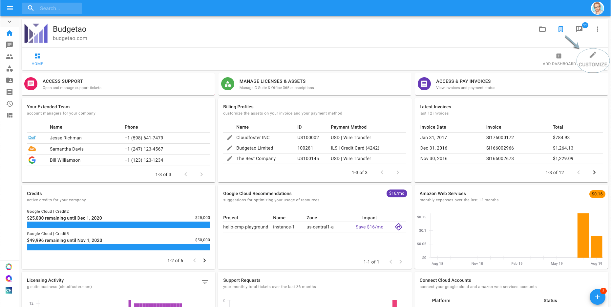
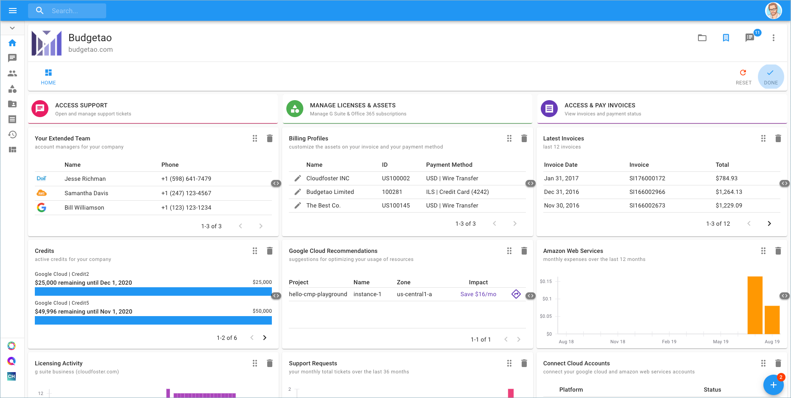
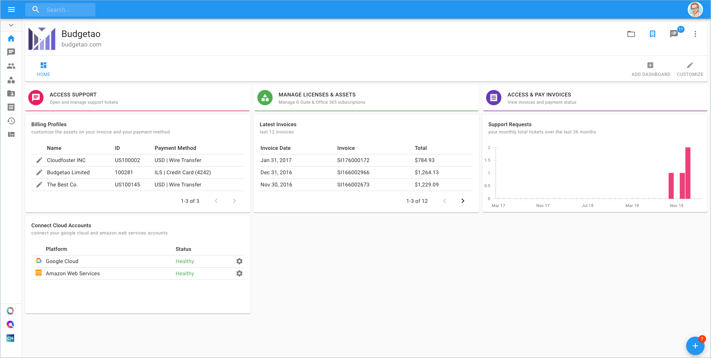

# Customize Dashboards

To personalize the appearance of your Home Dashboard, you can reorder the widgets to your preference, or remove them from the dashboard entirely.

On the Home Dashboard go to the right-hand side of the page and click on 'Customize'.

After clicking the 'Customize' button, you can move the widgets around and in addition, remove them from the dashboard.

After clicking 'Done', I have my new view of the Home Dashboard.

