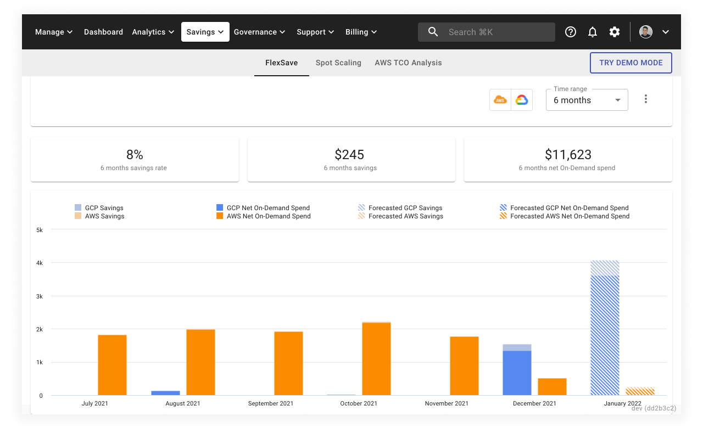
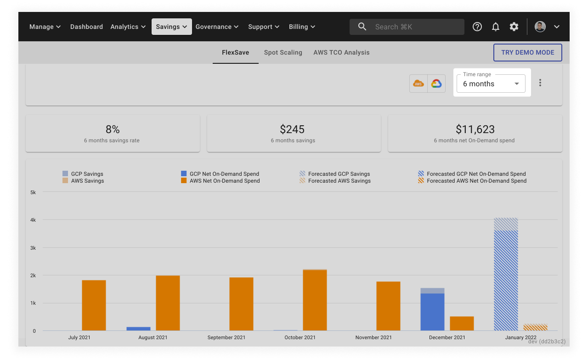
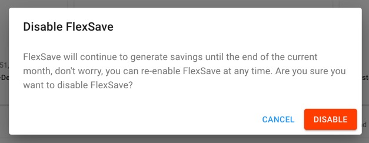
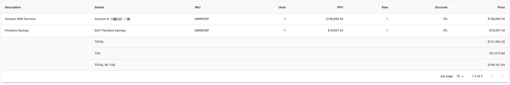

# FlexSave for AWS Overview

## Overview

FlexSave helps you maximize EC2 discounts with minimal-to-no commitments.

In order to use FlexSave, your AWS account must be [consolidated](https://docs.aws.amazon.com/awsaccountbilling/latest/aboutv2/consolidated-billing.html) with the DoiT International billing organization. DoiT International is a global [AWS Advanced Channel Reseller](https://partners.amazonaws.com/partners/001E000001HPlIAIA1/).


Required Permissions: **FlexSave Admin** Default roles with this permission: **Power User, Admin**


## FlexSave 

FlexSave automates the management of AWS Reserved Instances and Saving Plans so that you realize the largest possible EC2 savings without having to make any commitments.


FlexSave works by performing a sophisticated, AI-based analysis of your AWS workloads and identifies the ideal blend of Reserved Instances, automatically applying it to your account/s.


FlexSave can be found under 'Savings' in the top navigation.

Once on the FlexSave page, you'll see a preview of your team's potential savings for the following month if you enable FlexSave.

Click "**START SAVING**" to turn it on.

After enabling FlexSave, you'll see your FlexSave Dashboard which displays important insights into your FlexSave savings.

Let's go over the elements of your FlexSave Dashboard:

### FlexSave Dashboard

Your FlexSave Dashboard has three widgets, which displays $ savings resulting from using FlexSave:

* **Month's savings rate (%)**: Savings from FlexSave expressed as $ saved / pre-FlexSave on-demand spend
* **Month's savings ($)**: FlexSave savings are expressed in absolute dollars saved.
* **Month's net on-demand spend**: On-demand spend _after_ subtracting FlexSave savings.


If you've never previously used FlexSave or purchased Flexible Reserved Instances through the DoiT CMP, the "Last month's savings" widget will not appear during the first month you use FlexSave.


#### Adjusting Time Ranges

By default, the three widgets in your FlexSave Dashboard display data for the current month.

You may adjust the time range by clicking in the dropdown under "Time range" as shown below and selecting a different time interval.

Finally, your FlexSave Dashboard contains a stacked-column chart displaying FlexSave savings and net on-demand EC2 spend from previous months, your current month, and a forecast of both for the next month.

Columns displaying data for the current and previous months are broken down into two parts:

* **Savings**: Your $ savings realized from using FlexSave
* **Net on-demand spend**: Your on-demand EC2 spend, net of savings realized from using FlexSave


Historical data will only show up if you've previously used FlexSave, or if you purchased Flexible Reserved Instances through the DoiT CMP in the past.


The column displaying data for the next month contains two parts as well:

* **Forecasted savings**: Anticipated savings assuming you continue to use FlexSave, based on AI analysis of your AWS workloads.
* **Forecasted net on-demand spend**: Anticipated on-demand EC2 spend, net of the forecasted savings from using FlexSave

### **Disabling FlexSave**

If you prefer to turn off FlexSave, click on the vertical ellipsis in the top-right corner of the FlexSave page. Then select "Disable FlexSave".

A confirmation pop-up will appear, explaining that FlexSave will continue to generate savings until the end of the month.

Click "Disable" to turn off FlexSave.

### FlexSave Invoices

In your monthly bill you'll see a line item with the following details in your invoice:

* **Description**: FlexSave Savings
* **Details**: DoiT FlexSave Savings
* **Units**: -1
* **PPU**: {{Your monthly savings}}

The dollar amount displayed under "PPU" will be subtracted from your overall EC2 spend.

