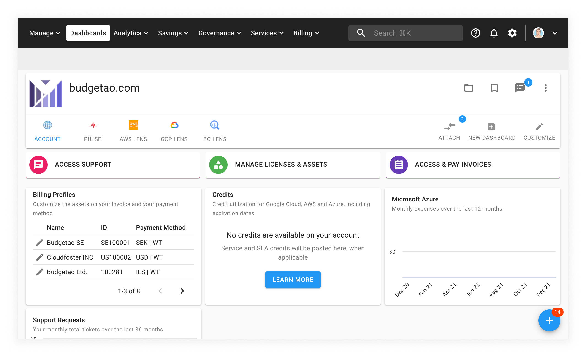
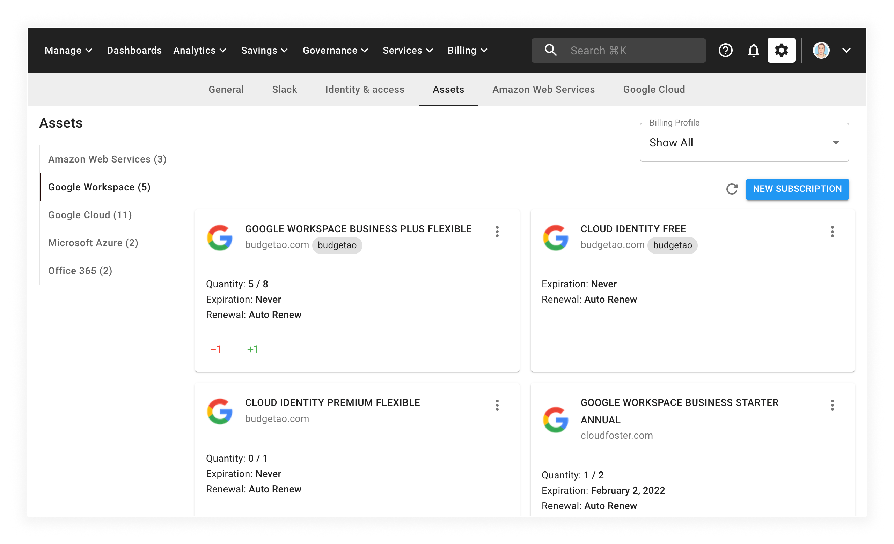
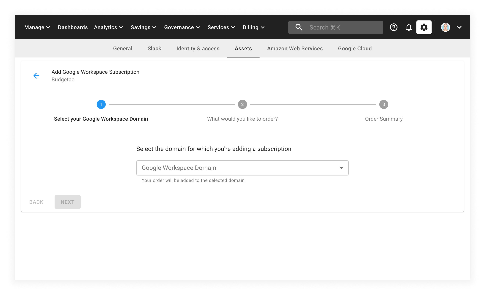

# Add a New G Suite Subscription

If you would like to purchase a new G Suite subscription, you can do so through the Cloud Management Platform.


Required Permission: **Assets Manager**


_Please note that you must be assigned access to the specific Billing Profile under which the domain is managed in order to purchase a new subscription._

Start from the main CMP dashboard and select the _MANAGE LICENSES & ASSETS_ button in the middle of the screen:

from the _Assets_ page, select _Google Workspace_ from the left-hand menu:

To add a new G Suite subscription, select the _NEW SUBSCRIPTION_ button in the top right-hand corner of the page.

Adding a new subscription will take you through a few steps, allowing you to customize your order:

After reviewing your order, select the _SUBMIT_ button to complete the purchase.
