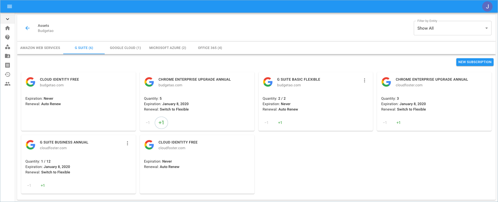
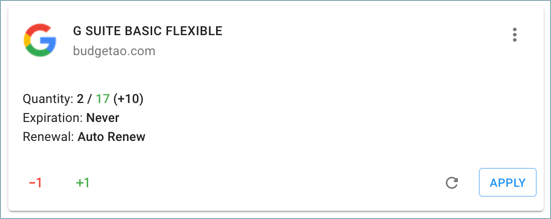
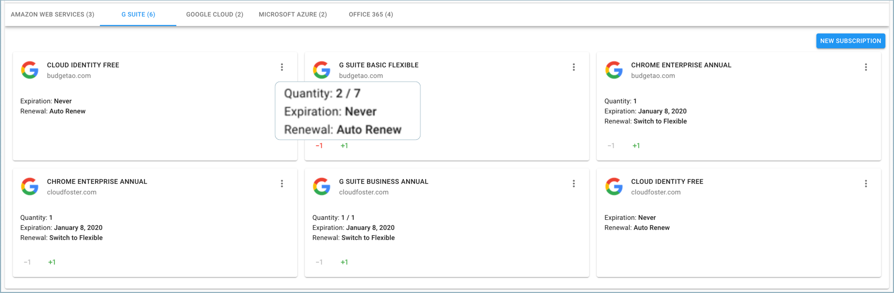

# Purchasing G Suite Licenses

If you’re on the Annual or Flexible plans and use up all your licenses, you can easily purchase more. We increase your monthly payment to cover the new licenses.


Required Permission: **Assets Manager**



Please note that you must be assigned access to the specific Billing Profile under which the domain is managed in order to purchase a license.


Start with accessing the G Suite based Assets from the menu on the left-hand side of the page and clicking on Assets.

 (5) (5) (6).png>)

Once you're at the Assets page, switch to the G Suite tab.

!\[A screenshot showing the location of the _G Suite_ tab(<../.gitbook/assets/g-suite (2) (2) (2) (1).png>)

Locate the subscription you'd like to add licenses for and click the **+** icon to add as many licenses as needed.

Add up to as many licenses as you wish, and click 'Apply'.

Finally, you may approve the purchase by clicking the 'Approve' button.

**Understanding License Utilization:**

You can see the number of licenses in use under the _Quantity_ field, versus how many are available. In the following example, two licenses are in use from seven licenses available.

**Decreasing the Number of Licenses:**

It is possible to decrease the number of licenses that are not in use. By doing this, you will not have to pay for the licenses available if you aren't planning to use them. The charges will be deducted from your account as reflected in the next month's billing to your organization.

Please note that only FLEXIBLE plans allow you to decrease the number of licenses. For more information, please review [this post](https://support.google.com/a/answer/6154359).
