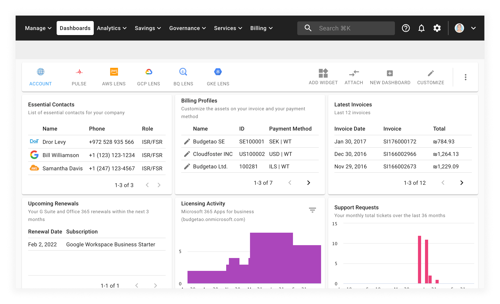

# Upgrading G Suite Subscription

As a customer, you are able to upgrade your G Suite subscription to get more business features and administrator controls.


Required Permission: **Assets Manager**



Please note that you must be assigned access to the specific Billing Profile under which the domain is managed in order to upgrade your subscription.


Start from the main CMP dashboard and select the _MANAGE LICENSES & ASSETS_ button in the middle of the screen:

from the _Assets_ page, select _Google Workspace_ from the left-hand menu:

To upgrade to a higher edition, locate the G Suite subscription for which you want to upgrade, and click on the three-dots icon on the right-hand side of the widget. Then choose 'Change G Suite Edition'.

Upgrade options:

* G Suite Basic to Business or Enterprise edition
* G Suite Business to Enterprise edition

Select the G Suite edition you'd like to upgrade to, and click on 'Submit'.

An email notification confirming your recent order will be sent to you.

