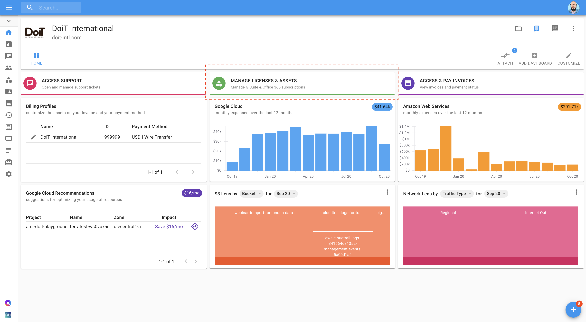
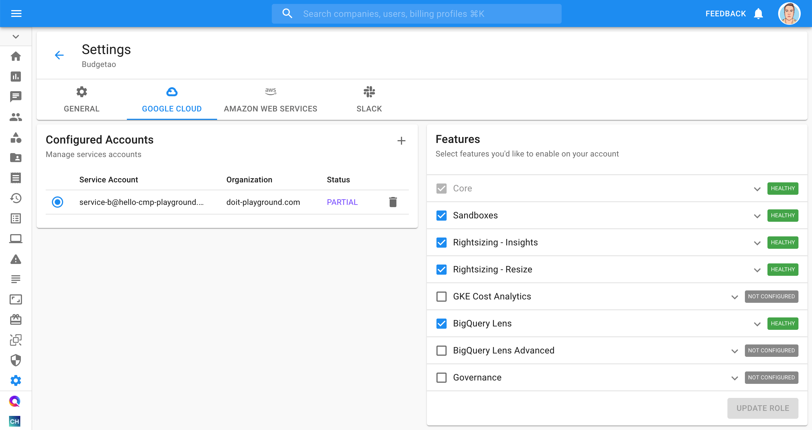

# Create Google Billing Account

## Overview

The _Cloud Billing accounts_ are used to define who pays for a given set of Google Cloud resources and _Google Maps Platform APIs_. Access control to a Cloud Billing account is established by IAM roles. A Cloud Billing account is connected to a DoiT International [billing profile](../invoices-and-payments/setting-up-a-new-billing-profile.md).

Use these instructions to create a Google Cloud Billing Account and link it to your company's billing profile using the Cloud Management Platform.


Required Permissions: _Assets Manager_



Please note: Your user account must be linked to at least one billing profile in the _Cloud Management Platform_.


## Create a new Billing Account

Start with you logging into the [Cloud Management Platform](https://app.doit-intl.com), and select _Manage Licenses & Assets_ from the main dashboard:

Once you're at the Assets page, switch to the Google Cloud tab and select _New Billing Account_, located on the right-hand side of the page.

.png>)

You will be prompted with a pop-up requesting you to enter your Google _Billing Account Name_, _Billing Profile_, and the email addresses of designated _Billing Account Administrators_.

.png>)

After a few seconds, you should now see the new billing account:

 (1).png>)


Your domain is added as a _Billing Account User_ on the new Billing Accounts you create in the CMP. This allows anyone on the domain to link projects to the billing account.


The following video shows you how to create a Google Cloud Billing Account.



## Manage Billing Account Permissions


Only current Billing Admin(s) of the DoiT Billing Account can add or remove billing administrators.


From CMP navigation pane, select Assets > Google Cloud:

.png>):

Locate the Billing Account you want to update and click on the .png>) icon

.png>)

### Add a Billing Account Administrator

1. Click the .png>) icon for *Billing Admins*:

   .png>)

2. Input the email(s) of users you want to add as Billing Admin(s) then select *Save*:

   [A screenshot showing the location of the person icon](<../.gitbook/assets/image (98).png>)

### Remove a Billing Account Administrator

Find the billing admin you want to remove and click the .png>) next to their email

.png>)

Review and confirm the action by clicking .png>)

If you prefer to manage Billing Account permissions using your GCP Console, please follow the steps on GCP documentation.

.png>) [Update Cloud Billing permissions](https://cloud.google.com/billing/docs/how-to/billing-access#update-cloud-billing-permissions)

.png>) [Overview of Cloud Billing roles in IAM](https://cloud.google.com/billing/docs/how-to/billing-access#overview-of-cloud-billing-roles-in-cloud-iam)&#x20;
