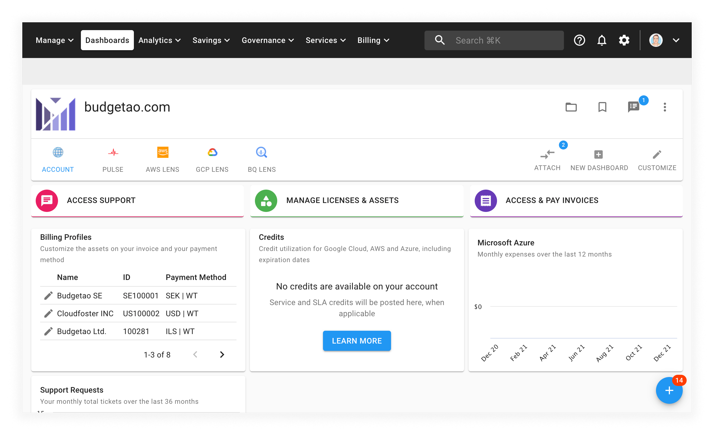
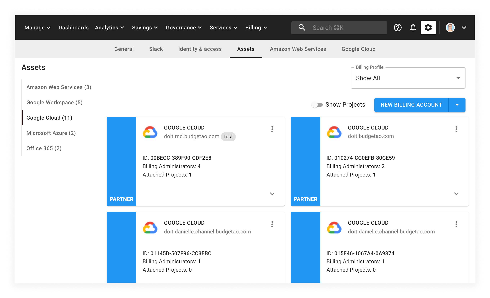
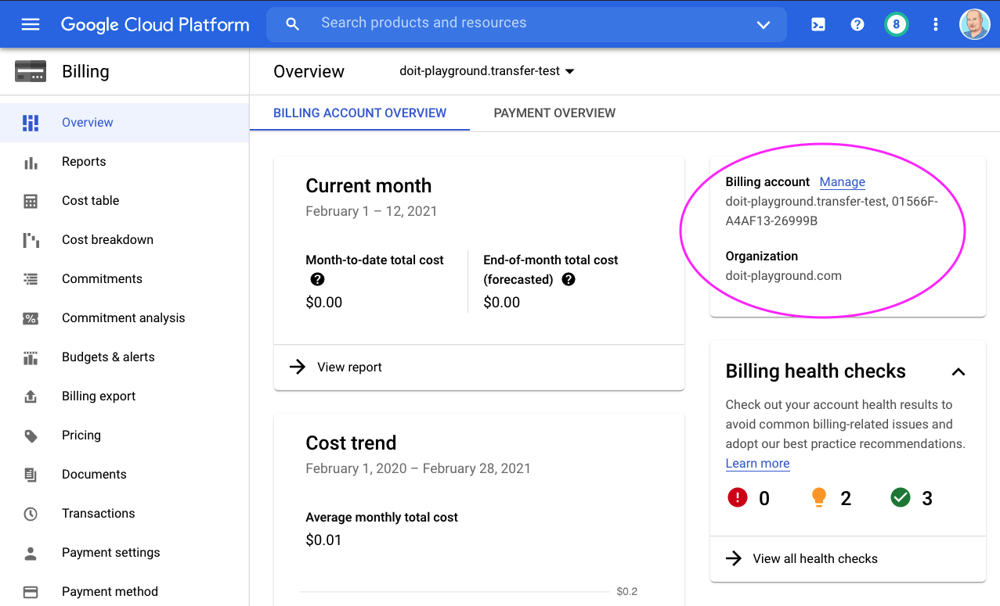
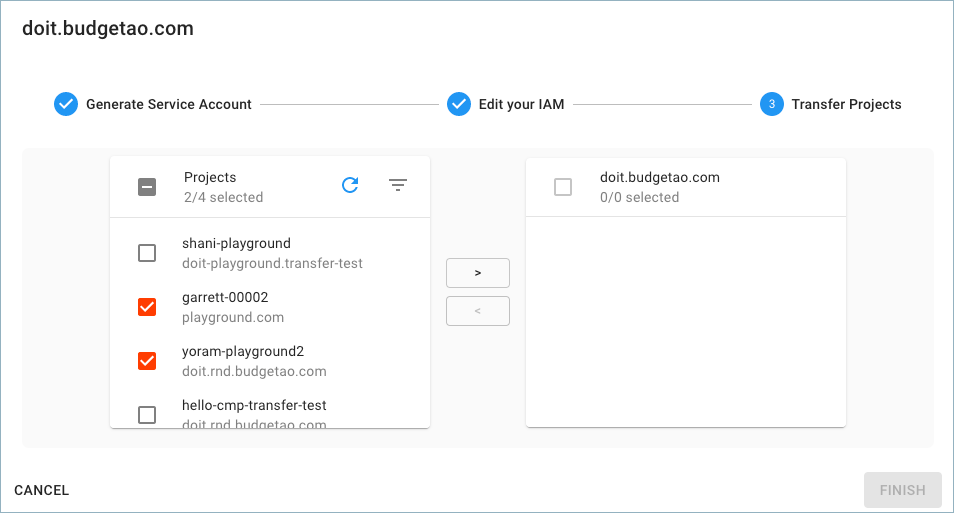

# Transfer Google Cloud Projects

## Overview

To change the Cloud Billing account for a project, you need to be able to move a project from your existing Cloud Billing account to another Cloud Billing account provided by DoiT International. To accomplish this task, you need permissions adequate to unlink the project from the existing Cloud Billing account AND to link the project to the target Cloud Billing account. Unfortunately, it is a manual process and requires a repetitive, one-by-one, transfer operation for each project. [Learn more.](https://cloud.google.com/billing/docs/how-to/modify-project#to_change_the_projects_account_do_the_following)

To make this process _much faster_, DoiT International developed a Project Transfer Tool in the Cloud Management Platform to help you bulk-transfer all of your existing Google Cloud projects to the billing account assigned to you by DoiT International.


Changing the billing account linked to a project could disable and result in data loss for any partner-managed services purchased through Google Cloud Marketplace. [Learn more](https://cloud.google.com/marketplace/docs/understanding-billing#changing_a_projects_billing_account)


Let's see how this is done.

## Generate a service account

Start with you logging into the [Cloud Management Platform](https://app.doit-intl.com), and select _Manage Licenses & Assets_ from the main dashboard:



Once you're at the _Assets_ page, select the _Google Cloud_ menu item on the left-hand side of the screen:



To transfer your projects, locate the billing account and select the three vertical dots in the top right-hand corner of the card. From the menu the appears, select _Transfer Projects_ to start the transfer wizard.

## Transfer wizard

When the transfer wizard first launches, you will be prompted to confirm that you do not currently use any services purchased through Google Cloud Marketplace.

After you begin the transfer process, a dedicated Google Cloud service account will be generated to facilitate the transfer process. Copy the name of the service account to your clipboard. You will need the name of your service account for the next step.

### Grant permissions to the service account

To ensure the transfer wizard can all of your projects, you will need to grant the _Billing Administrator_ role for the service account on your current billing account and your Google Cloud organization.

The wizard will provide a a `gcloud` CLI command to do this for you. If you would prefer to do it manually, you can follow the manual instructions in the next section.

#### How to grant permissions manually

##### Grant permissions on your Google Cloud organization

* Log in to your Google Cloud account
* Go to the Google Cloud [Resource Manager](https://console.cloud.google.com/cloud-resource-manager)
* Select your organization
* Open the permissions info panel located on the right-hand side of the screen
* Where prompted to add _New Members_, enter the service account email
* Then, select the _Billing Account Administrator_ role
* Finally, select _Save_

##### Grant permissions on your billing account

From your Google Cloud Console and select _Billing_ from the menu on the left-hand side of the screen. Then, select _Manage Billing Accounts_ when prompted.

Make sure your the proper organization is selected and then select the billing account you want to edit.

On the billing account _Overview_ screen, select the _Manage_ link in the top right-hand corner of the screen.

In the Billing Overview screen, select "Manage" on the right:



On the _Account management_ screen, select the _Show Info_ panel in the top-right hand corner of the screen. From there, select _Add Member_ button:


Finally, paste the service account name you copied earlier from the CMP Transfer wizarrd and add the _Billing Account Administrator_ role as shown below. Finally, select the _Save_ button.



If you incorrectly add the service account to one of your Google Cloud project IAM and not the organization IAM, the following error will appear:

> Service Account Not Found in Organization IAM.





If you don't have access to your Google Cloud organization IAM, you can send the `gcloud` command provided earlier by the transfer wizard to someone else in your organization with access to IAM.



### Transfer your projects

On the final screen of the wizard, select the projects you want to transfer to your new Google Cloud billing account with DoiT International.



Select projects using the checkboxes and use the arrow buttons to transfer projects.

After selecting which projects to transfer, select the _Finish_ button. A confirmation page will tell you how many projects were transferred. Select the link provided to retrieve the list of projects that were transferred.



In the case that some projects could not not be transferred, you will be presented with a summary screen to help you diagnose the problem. See the next section for more information.



## Troubleshooting

### All / Some Projects Don't Transfer Successfully

There are a few "edge case" situations in which some or all of your Google Cloud projects won't transfer successfully:

1. The project\(s\) is associated with another Google Organization that the service account doesn’t have an access to.
2. The origin billing account is not under the Organization the service account has permissions to.

To identify which project\(s\) didn't transfer successfully, click on the hyperlinked "Click here" in the pop-up shown above. This will copy to clipboard all of the projects you attempted to transfer, as well as their statuses.

Here is an example output:

```text
project-id-1, success
project-id-2, success
project-id-3, error-code
```

From here you can troubleshoot the project\(s\) that have "error-code" for one of the two "edge case" situations we described above.

### Accidentally Added Service Account at the Project Level

As mentioned above, you will get an error if you add your service account to at the Project level and not the Organization level. The error will look something like: _**"Service Account Not Found in Organization IAM"**_

To fix the situation please grant the service account Billing Account Admin role at the Organization level as described above and try again.

## Video

The following video shows you how to Transfer Google Cloud Projects.


