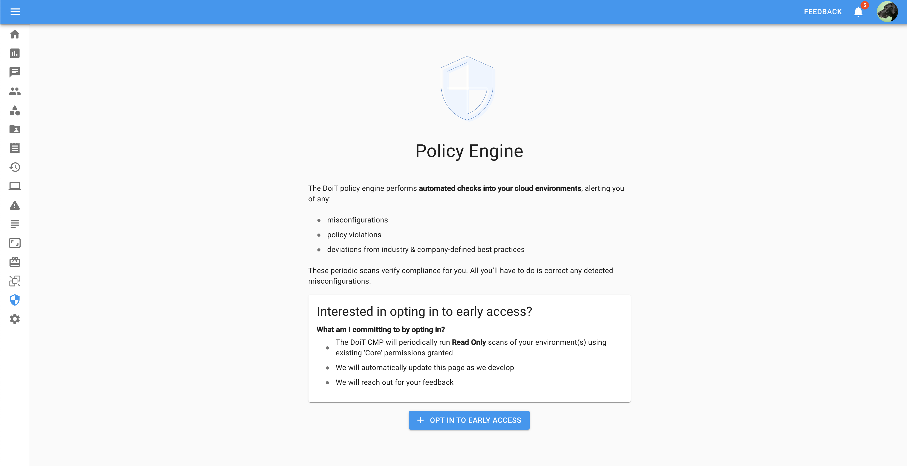

# Policy Engine Early Access

## Overview

The DoiT Policy Engine is a new core feature in our CMP. It's goal is to provide an automated, flexible set of rules that can be run against a your cloud environments. By automating industry standard and benchmarks, you can always be sure that your environments are configured according to best practice. Overtime we expect this engine to grow to support a wide range of use-cases including: tag compliance and enforcement, cost waste reduction, security auto remediation, and more.

The initial release is focused on providing out of the box value - a simple preset experience that leverages a recognized industry best practice. These presets will leverage CIS Foundations benchmarks for GCP and AWS as an initial policy set. In the future this will grow to include additional standards from the industry as built-in policy packs. In addition, customers will have the ability to define custom rules to catch more specific rules and scenarios for their business.

## Capabilities

* Scheduled Recurring Checks against current CIS Benchmarks for AWS and GCP
  * CIS AWS Foundations Benchmarks 1.2.0
  * CIS GCP Foundations Benchmarks 1.2.0
* Filterable Dashboard UI sorted by violation severity
* Actionable result to allow immediate remediation
* Read-only Rule set to inspect what is being run

### Early Access

If you would like to join the Early Access Program, navigate to the Governance Area and 'Opt-in' to include your company in the program.

Opting in Requires the preset 'Admin' Role in the CMP

### Requirements for Access

* You must have **Core Permissions** enabled for your GCP Organization, or your AWS Accounts.
* Explicit permission (granted via opting in) for DoiT to run Read Only scans of your environment based on the rules mentioned above
  * These checks are passive and make no changes to your environment
  * API requests will be seen within account logs
* Willingness to provide feedback based on early access to reports, dashboards, and UI mocks to help focus and validate releases.

## Enabling Core Permissions

Depending on whether you're enabling Core permissions for your Google Cloud Organization or AWS Accounts, the process will be different.

### Google Cloud

To grant Core permissions, you will need to create a Google Cloud Service Account, set up a Google Cloud IAM Role at the organization level, and upload the key to the Cloud Management Platform

To create a Google Cloud Service account, execute the following steps:

1. Open [Cloud Management Platform](https://app.doit-intl.com) and navigate to the Settings icon in your lefthand navigation panel
2. By default, "Core" is checked, but you may check additional features you'd like to enable within the CMP as well
3. \[Optional] Review the permissions each service requests by expanding the card
4. Click on "Create Service Account"

Next, a slide-out will appear on the right side of your screen, containing all of the Google SDK ([gcloud)](https://cloud.google.com/sdk) commands you need to run in order to create the service account and set it up with the correct role.

Before executing the gcloud commands, ensure that you have selected an appropriate project to create your service account. The project should be one that you are planning to keep long-term and that will only be accessible by only trusted people.

Next, copy the commands generated above and run them sequentially in your terminal or Google Cloud Shell.


The `gcloud` commands vary according to the boxes of the features you checked


Once you finished to run the gcloud commands, you can download the key in the JSON file for your new service account.

.png?alt=media)

The gcloud commands achieve the following:&#x20;

* the service account is created in one of the projects in your organization, and then
* the permissions for this service account are given on the organization level.

Congrats! You have now created a new "doit\_cmp\_role" linked to the "DoiT CMP Service Account", under your organization. Now it's time to upload the service account to the CMP.

.png?alt=media)

After you've generated a service account key, your next step is to upload the JSON file to the CMP by clicking on "Upload File".

If configured successfully, you should see a "**Healthy**" or "**Partial**" value appear under the "Status" column in the "Configured Accounts" widget.

"**Partial**" will only appear next to your configured service account if you didn't grant permissions for _all_ of the available features. What's important in this case is to examine the "Features" widget and verify that all of the features you selected have a "**Healthy**" status.

If there is something wrong with the JSON file you uploaded, you will see an "**Unhealthy**" value under the "Status" column.

### Amazon Web Services

To enable Core permissions for your AWS account(s), you will need to link your AWS account(s) to the Cloud Management Platform, you will need to create an AWS IAM Role and attach IAM Policies to it required for Core features.&#x20;

Follow [this article](https://help.doit-intl.com/amazon-web-services/link-account) to link your AWS account with the proper AWS policies.&#x20;

Note: If you're manually linking your AWS account, you need to add three built-in policies to your IAM role for Core:

* SecurityAudit
* Billing
* AWSSavingsPlansReadOnlyAccess

