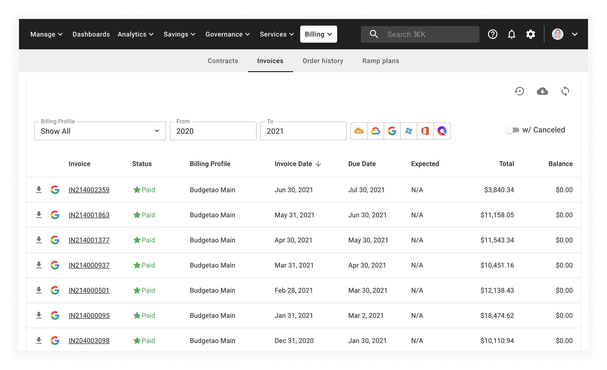

# Managing Invoices

As a customer, you can access your company invoices, including their full details and the actual invoice documents.


Required Permissions: **Invoice Viewer**


From the main CMP dashboard, select _Billing_ from the top menu bar, then select _Invoices_.

This action will take you to the _Invoices_ screen:

You can filter the invoices per billing profile to which it was issued, and by issue date of the invoice. To filter the invoices, use the drop-down controls at the top of the page.

In addition, there is the option to download the invoice summary as a CSV file by clicking the download icon (cloud with a downard arrow) in the top-right corner of the page.

There are five possible statuses for invoices:

1. **Open** — shows the amount owed and due date of the payment.
2. **Canceled** — canceled removes the charge but remains listed in your Sales Invoices history for review if necessary.
3. **Paid** — the amount was delivered and approved.
4. **Partially Paid** — the total amount was not fully delivered and has yet to have been approved.
5. **Past Due** — invoice due date of payment has passed.

By clicking on an invoice number (e.g., **IN1940032243**) you can review additional details of the invoices such as detailed invoice lines. There is also the option to view the document as a PDF file.

If you would like to pay for an invoice now, select the _PAY NOW_ button in the top right-hand corner of the screen.



For further instructions on how to pay for an invoice, please see the [Paying Invoices](paying-invoices-with-credit-card-or-ach.md) documentation.


