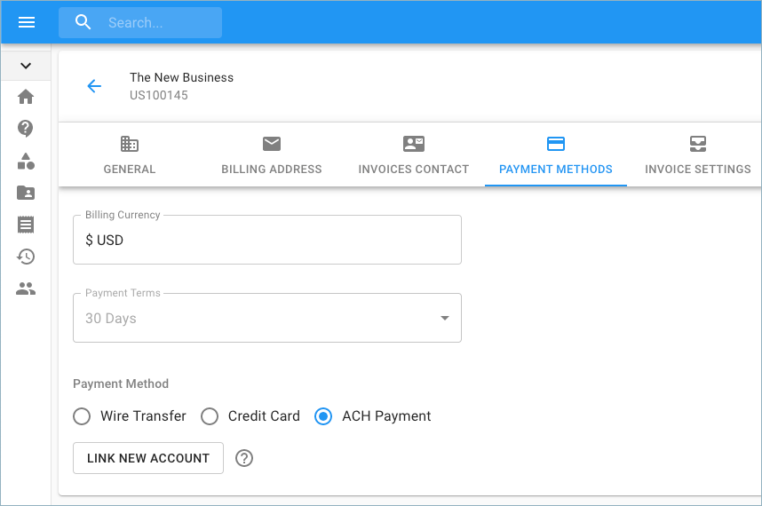
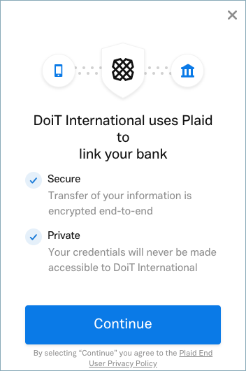
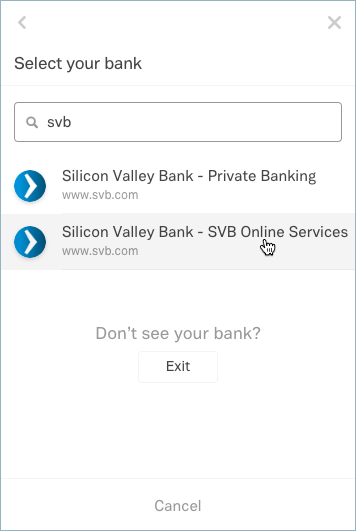
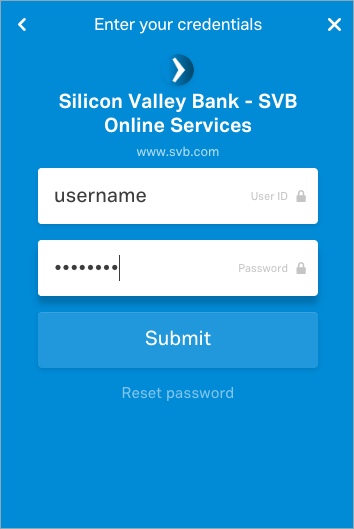
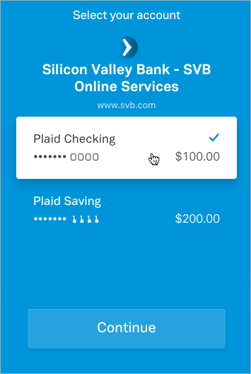
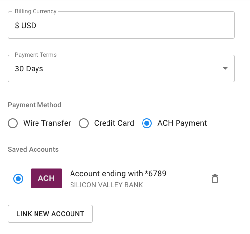
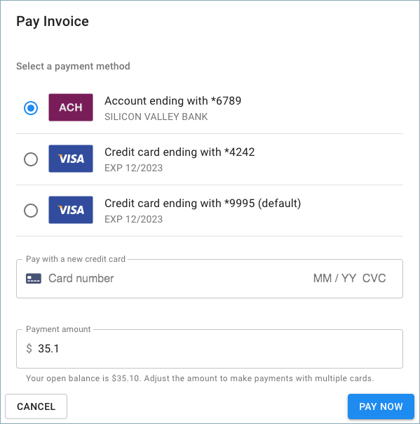

# Set up ACH Payments

You can pay your invoices by using ACH \(Automated Clearing House\) via the Cloud Management Platform. Please follow the step-by-step instructions on how to set up an ACH Payment for your company.


Required Permissions: **Billing Profile Admin**



Please note that you must be assigned access to the specific Billing Profile under which the domain is managed in order to purchase a license.


From the main dashboard, click on the edit icon next to the Billing Profile of which you want to update.

Once you're at the Billing Profile Settings page, switch to the 'Payment Methods' tab, select 'ACH Payment', and click on 'Link New Account' to link your bank account.

## Link Account

We use Plaid \(plaid.com\) to perform secure ACH payments authorizations which don't require making small deposits to your account for verification.

Next, choose your bank.

Then enter the same credentials used for your online banking account.

After that, choose either a 'Checking' or 'Saving' account.

Finally, your bank account details should successfully be linked and saved for future ACH Payments.

## Pay Invoice with ACH

The saved ACH method will be available when you want to pay for future invoices.

We will automatically initiate ACH debits when your invoice is due. Please note, ACH payments take 4-7 days to process. While processing, the invoice will be shown with the "processing" state.

## Manually set up ACH payments

There are some edge cases where our ACH verification process doesn't work properly, such as when you have a Wells Fargo or Bank of America account with two-factor authentication enabled.

To manually set up ACH payments, open a support ticket under the "Billing" category, and provide the following information:

* routing number
* account number
* account holder name
* account holder type \(individual or company\)

Once we have this information, we will send two small deposits for verification purposes. Typically, these deposits take 1-2 business days to appear on your online statement.

The statement has a description that includes AMTS followed by the two deposit amounts. To validate your bank account information, follow up on the support ticket with this AMTS description once you see the deposits.
