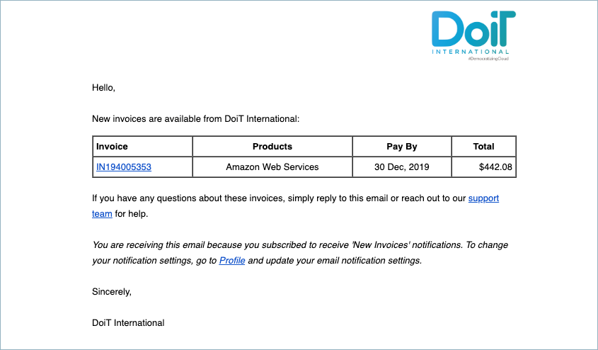

# New Invoices Notifications

Customers can be notified when a new invoice has been created by enabling the alerts for 'New Invoices' in the profile section of the Cloud Management Platform. The email will include a link to the invoice which will allow online payments.

In order to enable or disable the notification itself, click your profile icon in the upper-right corner of the page header, then select **Profile.**

 (3) (3) (1) (2) (1).png>)

Select the '**Notifications**' tab and check the box for '**New Invoices**'. This change will automatically save.

 (1).png>)

Below is an example of the new invoice email notification we will send out.

