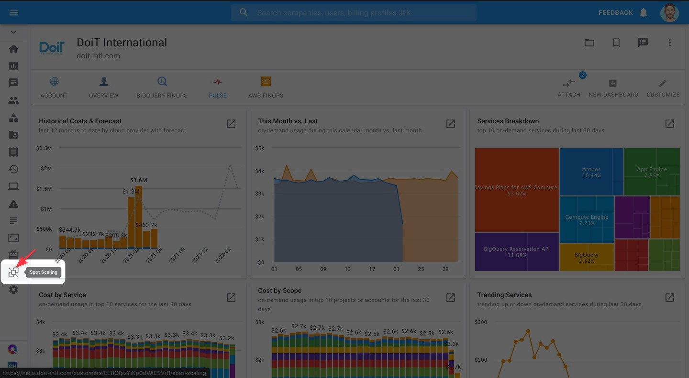

# Setting Up Spot Scaling

## Connect your AWS Accounts

To use Spot Scaling, you must provide access to your AWS account(s) to the CMP. [**Read this article**](https://help.doit-intl.com/amazon-web-services/add-your-amazon-web-services-iam-role) to see how to link your AWS account(s).


If you’ve already linked your AWS account(s) to the CMP, go to this step instead.


As part of linking your account, you will need to create an AWS IAM Role and attach an IAM Policy to it containing a requisite set of permissions. These permissions allow Spot Scaling to function — monitor your ASG behavior, make spot instance recommendations, and allow you to implement them from the CMP

In the same article linked above, read the section on [**how to create a policy for Spot Scaling**](https://help.doit-intl.com/amazon-web-services/add-your-amazon-web-services-iam-role#spot-scaling) with the requisite permissions.

### AWS Account previously linked

If your account was already linked prior to enabling Spot Scaling functionality, you need to update the role attached to the account with the additional requisite permissions for Spot Scaling.

**Follow** [these instructions](https://help.doit-intl.com/amazon-web-services/add-your-amazon-web-services-iam-role#adding-a-feature) **on adding a feature to an already-linked AWS account**. Be sure to check the box next to "Spot Scaling", as shown below.

.png>)

## Implement Spot Scaling Recommendations

### View Recommendations

To navigate to your Spot Scaling recommendations, click on the Spot Scaling icon in your lefthand navigation panel.

Once an AWS account is linked, any Auto Scaling Groups (ASGs) associated with it which aren't optimized will appear in your Spot Scaling page.

These ASGs will have a value of "Not Optimized" under the "Optimization Status" column.

Click on the ASG to view its Spot Scaling recommendation.

Your ASG's current configuration is displayed under the "Current Values" column. Spot Scaling's recommendations are displayed under the "Recommended Values" column.

### Apply Recommendations

After selecting an un-optimized Auto Scaling Group, its current configuration will be displayed under the "Current Values" column. Spot Scaling's recommendations are displayed under the "Recommended Values" column.

You will also see the current on-demand costs and hours running for that Auto Scaling Group at the top-left corner.

Examine the recommendations. If needed, you can adjust several aspects of the recommendation to your liking. You may modify the following values of a recommendation:

* On-Demand Base Capacity
* On-Demand Instances
* Spot Instances
* Allowed Instance Types
* Availability Zones

If you want to edit values under "Allowed Instance Types" and "Availability Zones", click on the corresponding "EDIT" button.

Then, once you've made your changes, click on "UPDATE"

Once the proposed changes seem satisfactory with you, click on **APPLY RECOMMENDATIONS** to reconfigure your ASG according to Spot Scaling's recommendations.

Once you've applied the recommendation, the "Recommended Values" column will disappear.

The values under the "Current Values" column will update, reflecting the changes you made when applying the recommendation.

Additionally, once you apply the recommendation, the metrics appearing at the top will instead show actual cost/hour breakdowns for on-demand and Spot, as well as actual savings.

You can adjust the time range for which the metrics are displayed by clicking on the "Time Range" dropdown in the upper-right corner.

Finally, after applying a recommendation, your ASG will have a value of "Optimized" under the "Optimization Status" column.

### Additional Spot Scaling Settings

With Spot Scaling you have two optional features you can turn on when optimizing your ASG's configuration:

* **Keep my ASG up to date**: If turned on, Spot Scaling will automatically update the ASG's configuration to continuously maximize system runtime and spot-related EC2 savings.
* **Fallback to On-Demand**: When there aren't where enough unused EC2 instances to meet demand for Spot instances, Spot Scaling will automatically fallback to on-demand instances.

