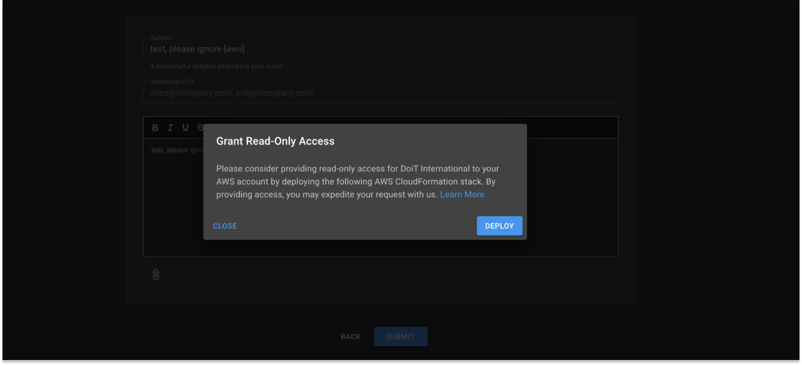

# Support Access to AWS

DoiT International provides complete transparency and access control when accessing your _Amazon Web Services_ (AWS) account.

When you open a technical support request with DoiT International, we may occasionally need to access your AWS account to help you most effectively. This document describes how to enable access and how access control works.

## Key points

* We only access your AWS account to provide technical support per our contractual obligations. We never access your AWS account for any other reason.
* DoiT employees must request support access on an incident-by-incident basis.
* You can approve or dismiss all access requests.
* Support engineers never have write-access to your AWS account.
* [AWS CloudTrail](https://docs.aws.amazon.com/awscloudtrail/latest/userguide/cloudtrail-user-guide.html) can provide a complete log of every action that we perform on your account.


When you grant an access request, the individual staff member will not have write-access to your account.

However, the CMP requires an automated management role with tightly-scoped write access to create individual read-only support roles in the securest way possible. DoiT staff members have no access to the management role, and the management role does not have write-access to any other part of your AWS account. See below for more details.


## Granting access

DoiT International uses secure [Identity Providers](https://docs.aws.amazon.com/singlesignon/latest/userguide/idp.html) (IdP) to provide support engineers with read-only access to your AWS account. The IdP uses [AWS CloudHSM](https://aws.amazon.com/cloudhsm/) to generate a unique cryptographic key pair for every support role. As a result, each key can only be used by one staff member to access a single AWS account.

When you request technical support and create a new service request with DoiT International, you will be prompted to grant DoiT International access to your AWS account:



To enable this process, you must configure an AWS CloudFormation stack which allows our system to interact with your account. We have prepared a [template configuration](https://console.aws.amazon.com/cloudformation/home?region=us-east-1#/stacks/quickcreate?templateUrl=https%3A%2F%2Fdoit-aws-ops-prod-templates.s3.amazonaws.com%2Fawsops\_sns.yaml\&stackName=DoiT-Management-Stack\&param\_AccountNumberParameter=462932234033\&param\_ServiceToken=arn%3Aaws%3Asns%3Aus-east-1%3A462932234033%3Aprod-cfn) for you to install.

## Technical details

Here's the [template YAML file](https://doit-aws-ops-prod-templates.s3.amazonaws.com/awsops\_sns.yaml) in full:

```yaml
AWSTemplateFormatVersion: '2010-09-09'
Description: >
  This template deploys the IAM Policies and Roles
  needed for AWS Ops. It takes a parameter to define
  if we need the payer roles as well.
Parameters:
  AccountNumberParameter:
    Type: String
    Description: Account number AWS Ops runs in
  ServiceToken:
    Type: String
    Description: Service Token to notify on execution
Resources:
  AssumeableRole:
    Type: AWS::IAM::Role
    Properties:
      RoleName: DoiT_Management_Role_DO-NOT-DELETE
      AssumeRolePolicyDocument:
        Version: 2012-10-17
        Statement:
          - Effect: Allow
            Principal:
              AWS:
              - !Ref AccountNumberParameter
            Action:
              - 'sts:AssumeRole'
  CustomerPolicy:
    Type: AWS::IAM::Policy
    Properties:
      PolicyName: DoiT_Customer_Policy_DO-NOT-DELETE
      PolicyDocument:
        Version: 2012-10-17
        Statement:
          # We allow List on all resources, this allows
          # us to know what we need to update/do
          - Effect: Allow
            Action:
              - 'iam:ListAttachedRolePolicies'
              - 'iam:ListEntitiesForPolicy'
              - 'iam:ListOpenIDConnectProviders'
              - 'iam:ListPolicies'
              - 'iam:ListPoliciesGrantingServiceAccess'
              - 'iam:ListPolicyVersions'
              - 'iam:ListRolePolicies'
              - 'iam:ListRoles'
            Resource:
              - '*'
          # We only allow updating on our own resources
          # which limits our ability to delete anything.
          - Effect: Allow
            Action:
              - 'iam:AttachRolePolicy'
              - 'iam:CreateOpenIDConnectProvider'
              - 'iam:CreatePolicy'
              - 'iam:CreatePolicyVersion'
              - 'iam:CreateRole'
              - 'iam:CreateSAMLProvider'
              - 'iam:DeleteOpenIDConnectProvider'
              - 'iam:DeletePolicy'
              - 'iam:DeletePolicyVersion'
              - 'iam:DeleteRole'
              - 'iam:DetachRolePolicy'
              - 'iam:GetOpenIDConnectProvider'
              - 'iam:GetPolicy'
              - 'iam:GetPolicyVersion'
              - 'iam:GetRole'
              - 'iam:PutRolePolicy'
              - 'iam:SetDefaultPolicyVersion'
              - 'iam:UpdateOpenIDConnectProviderThumbprint'
              - 'iam:UpdateRole'
              - 'iam:UpdateRoleDescription'
            Resource:
              - !Sub 'arn:${AWS::Partition}:iam::${AWS::AccountId}:oidc-provider/oidc.aws-ops.doit-intl.com*'
              - !Sub 'arn:${AWS::Partition}:iam::${AWS::AccountId}:policy/DoiT-*'
              - !Sub 'arn:${AWS::Partition}:iam::${AWS::AccountId}:role/DoiT-Support*'
      Roles:
        - !Ref AssumeableRole
  Hook:
    Type: Custom::Hook
    Version: "1.0"
    Properties:
      ServiceToken: !Ref ServiceToken
      RoleArn: !GetAtt AssumeableRole.Arn
      AccountId: !Ref "AWS::AccountId"
    DependsOn:
      - CustomerPolicy
Outputs:
  RoleName:
    Value: !Ref AssumeableRole
  RoleArn:
    Value: !GetAtt AssumeableRole.Arn
```

Please note:

* CloudFormation will create a management role that allows us to create, update, and delete individual support roles.

  For each support role, we use the management role to generate a unique cryptographic key pair. Because key creation has to be done by your [IdP](https://docs.aws.amazon.com/singlesignon/latest/userguide/idp.html), the management role itself requires some limited write permissions. However:

  * The CMP has automated access to the management role, and this is how our systems interact with your account. DoiT staff members _do not_ have access to the management role.

  * The management role's write permissions are tightly scoped and only grant what is necessary to perform key generation and the management of DoiT support roles.

  Crucially, _the management role can only modify the IAM policies and roles that it creates itself_. The management role does not have write-access to any of your other IAM policies or roles.

* We create an IAM Policy and IAM Role for each staff member with the [SecurityAudit](https://console.aws.amazon.com/iam/home#policies/arn:aws:iam::aws:policy/SecurityAudit) policy attached to each role.
