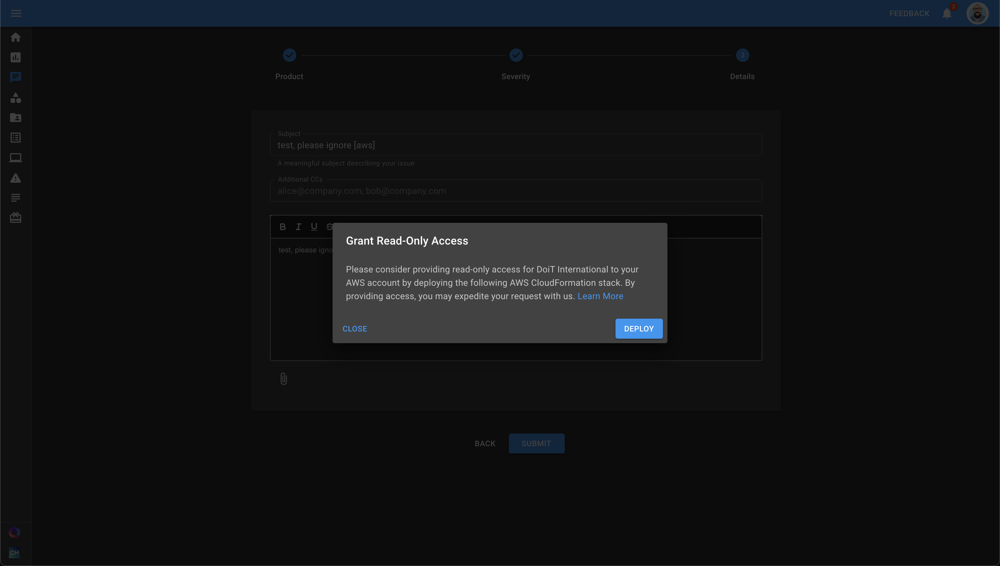

# Read-Only Access to AWS

DoiT International is committed to client account access transparency and access approval. When you open a technical support request with DoiT International, we may occasionally need read-only access to your AWS account to help you most effectively.

## Key points

* We only access your AWS account to provide technical support per our contractual obligations to you. We never access your AWS account for any other reason.
* Individual employees must request support access on an incident-by-incident basis.
* You can approve or dismiss all access requests.
* Support access only grants read-only access to your AWS account.

## Granting access

DoiT International uses secure [Identity Providers](https://docs.aws.amazon.com/singlesignon/latest/userguide/idp.html) (IdP) to provide support staff with read-only access to your AWS account. The IdP uses [AWS CloudHSM](https://aws.amazon.com/cloudhsm/) to generate a unique cryptographic key pair for every support role. As a result, each key can only be used by one staff member to access a single AWS account.

When you request technical support and create a new service request with DoiT International, you will be prompted to grant DoiT International access to your AWS account:



To enable this process, you must configure an AWS CloudFormation stack which allows our system to interact with your account. We have prepared a [template configuration](https://console.aws.amazon.com/cloudformation/home?region=us-east-1#/stacks/quickcreate?templateUrl=https%3A%2F%2Fdoit-aws-ops-prod-templates.s3.amazonaws.com%2Fawsops_sns.yaml&stackName=DoiT-Management-Stack&param_AccountNumberParameter=462932234033&param_ServiceToken=arn%3Aaws%3Asns%3Aus-east-1%3A462932234033%3Aprod-cfn) for you to install.

## Technical details

Here's the [template YAML file](https://doit-aws-ops-prod-templates.s3.amazonaws.com/awsops_sns.yaml) in full:

```yaml
AWSTemplateFormatVersion: '2010-09-09'
Description: >
  This template deploys the IAM Policies and Roles
  needed for AWS Ops. It takes a parameter to define
  if we need the payer roles as well.
Parameters:
  AccountNumberParameter:
    Type: String
    Description: Account number AWS Ops runs in
  ServiceToken:
    Type: String
    Description: Service Token to notify on execution
Resources:
  AssumeableRole:
    Type: AWS::IAM::Role
    Properties:
      RoleName: DoiT_Management_Role_DO-NOT-DELETE
      AssumeRolePolicyDocument:
        Version: 2012-10-17
        Statement:
          - Effect: Allow
            Principal:
              AWS:
              - !Ref AccountNumberParameter
            Action:
              - 'sts:AssumeRole'
  CustomerPolicy:
    Type: AWS::IAM::Policy
    Properties:
      PolicyName: DoiT_Customer_Policy_DO-NOT-DELETE
      PolicyDocument:
        Version: 2012-10-17
        Statement:
          # We allow List on all resources, this allows
          # us to know what we need to update/do
          - Effect: Allow
            Action:
              - 'iam:ListAttachedRolePolicies'
              - 'iam:ListEntitiesForPolicy'
              - 'iam:ListOpenIDConnectProviders'
              - 'iam:ListPolicies'
              - 'iam:ListPoliciesGrantingServiceAccess'
              - 'iam:ListPolicyVersions'
              - 'iam:ListRolePolicies'
              - 'iam:ListRoles'
            Resource:
              - '*'
          # We only allow updating on our own resources
          # which limits our ability to delete anything.
          - Effect: Allow
            Action:
              - 'iam:AttachRolePolicy'
              - 'iam:CreateOpenIDConnectProvider'
              - 'iam:CreatePolicy'
              - 'iam:CreatePolicyVersion'
              - 'iam:CreateRole'
              - 'iam:CreateSAMLProvider'
              - 'iam:DeleteOpenIDConnectProvider'
              - 'iam:DeletePolicy'
              - 'iam:DeletePolicyVersion'
              - 'iam:DeleteRole'
              - 'iam:DetachRolePolicy'
              - 'iam:GetOpenIDConnectProvider'
              - 'iam:GetPolicy'
              - 'iam:GetPolicyVersion'
              - 'iam:GetRole'
              - 'iam:PutRolePolicy'
              - 'iam:SetDefaultPolicyVersion'
              - 'iam:UpdateOpenIDConnectProviderThumbprint'
              - 'iam:UpdateRole'
              - 'iam:UpdateRoleDescription'
            Resource:
              - !Sub 'arn:${AWS::Partition}:iam::${AWS::AccountId}:oidc-provider/oidc.aws-ops.doit-intl.com*'
              - !Sub 'arn:${AWS::Partition}:iam::${AWS::AccountId}:policy/DoiT-*'
              - !Sub 'arn:${AWS::Partition}:iam::${AWS::AccountId}:role/DoiT-Support*'
      Roles:
        - !Ref AssumeableRole
  Hook:
    Type: Custom::Hook
    Version: "1.0"
    Properties:
      ServiceToken: !Ref ServiceToken
      RoleArn: !GetAtt AssumeableRole.Arn
      AccountId: !Ref "AWS::AccountId"
    DependsOn:
      - CustomerPolicy
Outputs:
  RoleName:
    Value: !Ref AssumeableRole
  RoleArn:
    Value: !GetAtt AssumeableRole.Arn
```

Please note:

* CloudFormation will create a management role that allows us to create, update, and delete individual support roles

  For each support role, we use the management role to generate a unique cryptographic key pair. Because key creation has to be done by your [IdP](https://docs.aws.amazon.com/singlesignon/latest/userguide/idp.html), the management role itself requires some limited write permissions. However:

  * The CMP has privileged access to the management role, and this is how our systems interacts with your account. DoiT staff members _do not_ have access to the management role.
  * The management role's write permissions are tightly scoped and only grant what is necessary to perform key generation and the management of DoiT support roles.

    Crucially, _the management role can only modify the IAM policies and roles that it creates itself_. The management role does not have write-access to any of your other IAM policies or roles.

* We create an IAM Policy and IAM Role for each staff member with the [SecurityAudit](https://console.aws.amazon.com/iam/home#policies/arn:aws:iam::aws:policy/SecurityAudit) policy attached to each role.
