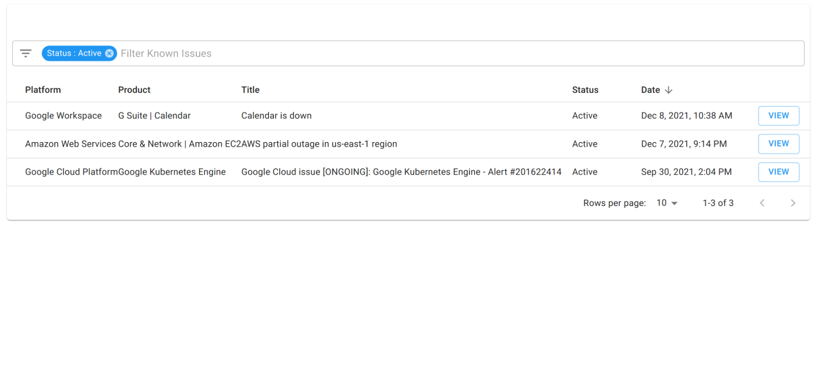

# Cloud Incidents

**Cloud Incidents** are defined as any faults or defects in Google Cloud, Amazon Web Services, or Microsoft Azure services that may be impacting the performance or availability of your applications.

Any Cloud Incident from these platforms are displayed on the Known Issues page, accessible via the "Governance" menu in the navigation bar.

In the event that one or more of your cloud services aren't functioning as they normally do, before opening a ticket with DoiT International we recommend you check the Known Issues page.

If one of the incidents displayed looks to be related to the service issues you're experiencing, then opening a ticket with us is not advised. It will likely have to be resolved by the engineers on whichever cloud platform the issue is arising from.

Should you want to filter through Cloud Incidents, click on the filter button near the search box.

If you'd like to learn more about a particular Cloud Incident, then click on the **VIEW** button corresponding to the issue to see a detailed description.
