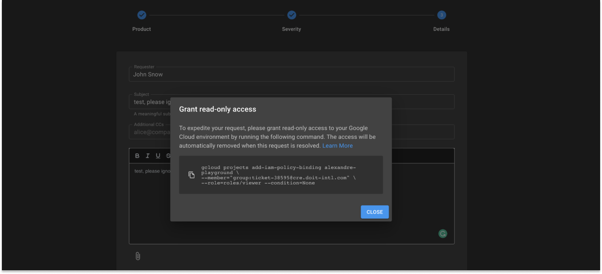

# Support Access to GCP

DoiT International provides complete transparency and access control when accessing your _Google Cloud Platform_ (GCP) account.

When you open a technical support request with DoiT International, we may occasionally need to access your GCP account to help you most effectively. This document describes how to enable access and how access control works.

## Important to Know

* We only access your GCP account to provide technical support per our contractual obligations. We never access your GCP account for any other reason.
* DoiT employees must request support access on an incident-by-incident basis.
* You can approve or dismiss all access requests.
* Support engineers never have write-access to your GCP account.

## How does it work?

When you request technical support and create a new service request with DoiT International, you will be prompted to grant DoiT International access to the relevant GCP project.

A typical access grant is implemented with a `gcloud` command (part of [Google Cloud SDK](https://cloud.google.com/sdk)). The access is always read-only, limited, and only provides access to the support engineers handling your request.

```
gcloud projects add-iam-policy-binding cassandra-db-prod-289507 \
--member="group:ticket-38432@cre.doit-intl.com" \
--role=roles/viewer --condition=None
```

For example, the above command:

* Grants read-only access (`--role=roles/viewer`)
* To a group of engineers assigned with request `#38432` ( `--member="group:ticket-38432@cre.doit-intl.com"`)
* For your Google Cloud project (`cassandra-db-prod-289507`)

We will automatically generate the command for you to copy and run:



## Revoke Access

Support access is automatically revoked for security reasons when the ticket is resolved. The next time you create a support request, you will be prompted to provide our support engineers with access again.
