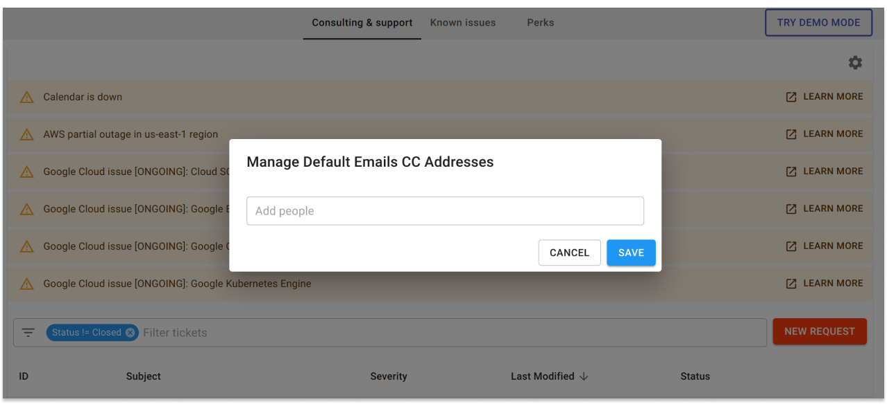

# Manage Default Email CC

You can configure additional email addresses to be always copied (CC) when you raise requests with DoiT International. This is particularly useful when key people within the org should always get visibility of an issue.


Required Permissions: **Billing Profile Admin**


Start with logging into the [Cloud Management Platform](../general/log-in.md) and in the navigation bar, click on "Services", "Consulting and Support

Locate the settings gear icon at the top-right of the page

Select 'Manage Default Emails List'

Add people you'd like to be always copied on new requests and click "Save"

