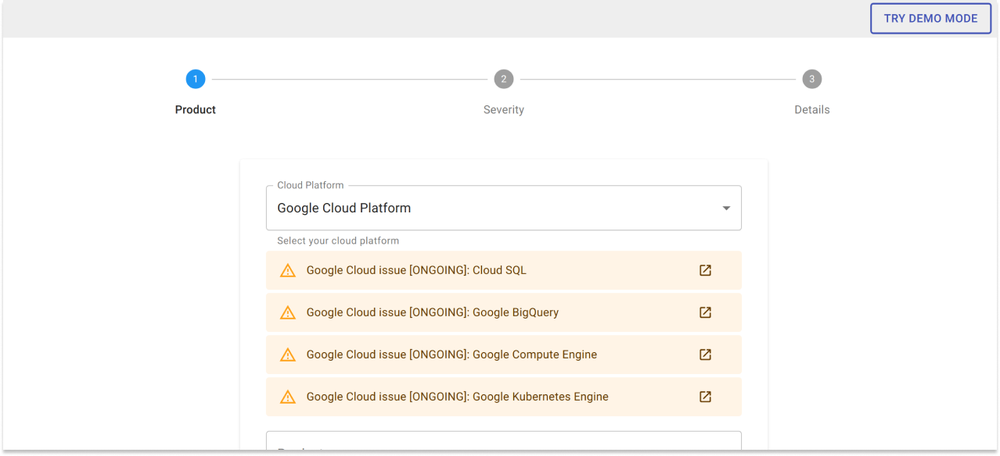
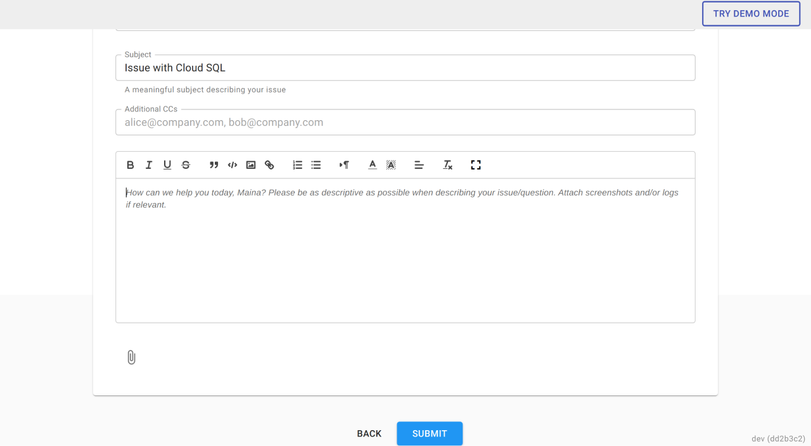

# Support or Advisory Requests

DoiT International provides unlimited advisory and technical support for Amazon Web Services, Google Cloud, and Microsoft Azure. As a customer, you are not limited to any number of support requests or how much time DoiT International invests in supporting you as a client. To open a support request with us, please file a ticket as instructed in this article.

New support or advisory request can be filed by clicking on the 'Access Support' from the home page, or from the menu on the left-hand side of the page.

Start with logging into the [Cloud Management Platform](../general/log-in.md) and in the navigation bar, click on "Services", "Consulting and Support"


By clicking on 'Allow' in your browser to show you notifications, the Cloud Management Platform will notify the requester (and anyone that is CC'd) each time an update is made to your support request.


**Once you are on the support page, click 'New Request' to create new support or advisory ticket.**

You're now on the creation page of the ticket. Choose your Cloud Platform, Product, Resource, and according to your selections, please choose the appropriate field (_AWS Account/Google Project ID/G Suite Domain/Office 365 Domain/Azure Tenant_) so we can route the ticket to the most appropriate engineer.

Note that we will also display any [Known Issues](cloud-infrastructure-known-issues.md) related to the cloud platforms you use. If one of the known issues displayed looks to be related to the service issues you're experiencing, it's fine to open a ticket with DoiT International but it is likely we are already working together with the cloud vendor engineers on whichever cloud platform the issue is arising from.

It is essential to be specific when choosing the Severity of your request, as each issue has a dedicated response time for the support team:

1. General Guidance = 4 hours
2. System Impaired = 2 hours
3. Production System Impaired = 1 hour
4. Production System Down = 30 minutes

Fill in the details of the issue with a clear Subject, relevant folks CC'd, and a full description.

Once ready, click Submit.


Please note that in some cases, your cloud vendor representative such as an account manager or customer engineer can be automatically copied on your request. If you do not wish to copy the vendor representative, please remove the vendor's email address from the "Additional CCs" list.

