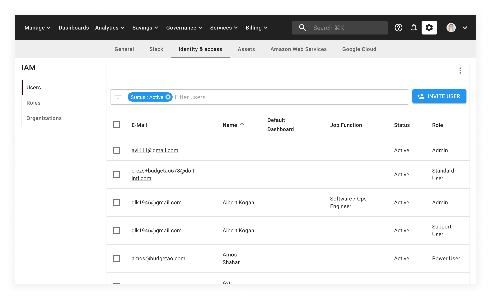
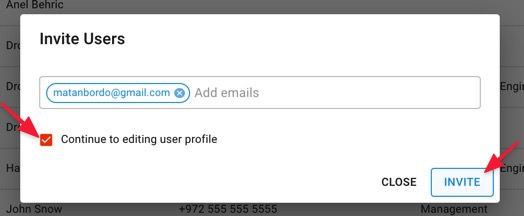
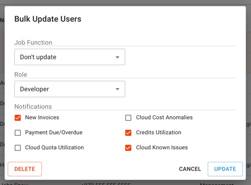

# Creating a New User

You can manage the access of other users on behalf of the organization, as well as create users for new employees who need access to the Cloud Management Platform.


Required Permissions: **User Manager**


## Inviting new users

Select the _Settings_ icon (a gear icon), then select the _Identity and access_.

Next, select the _INVITE USER_ button on the right-hand side of the page.

A modal dialog will appear, allowing you to add multiple email addresses you
want to invite. You are also given the option to check a box indicating that you would like to continue on to editing their user profiles.

The recipient(s) you invited will receive an email, which you will be CC'd on, inviting them to complete the sign up and use the CMP.

## Editing User Profiles

There are two ways you can access the page to edit a user's profile:

* Check the "Continue to editing user profile" box when initially inviting them.
* Click on their email in your Users list.

When editing a profile, you have four sections:

1. **Profile** - Set name, job function, and phone number of the user
2. **Permissions** - [Assign a role](manage-roles.md) to the user, which contains the [set of permissions](user-permissions-explained.md) they have.
3. **Notifications** - Determine which events you'd like the user to be notified on.
4. **API** - [Generate an API key](https://developer.doit-intl.com/docs/start) that lets you programmatically access CMP features.

### Bulk Editing

To perform bulk updates on users in your organization, check the boxes next to
the users you'd like to update then select the _Edit_ button.

A _Bulk Update Users_ modal dialog will appear, allowing you to make your
changes. This actopm canupdate multiple users' job function, role, and
notifications.

Once you've made your desired changes, select the _UPDATE_ button to confirm them.

You can also bulk delete users from your organization. Instead of selecting _UPDATE_, select _DELETE_.

### Notification Types

* _New Invoices_ — Get sent an email when a new invoice is uploaded to the Cloud Management Platform.
* _Cost Anomalies_ — Get notified when our system detects abnormal usage of your cloud platform (i.e., AWS or Google Cloud)
* _Payment Due/Overdue_ — Get automated updates when your invoices are becoming due and when they're overdue.
* _Credit Alerts_ — request to be notified when your credits are nearly exhausted (75% utilization), and once again when they've been exhausted.
* _Cloud Quota Utilization_ — Get alerted when your Google Cloud and/or AWS service quota utilization exceeds 80%.
* _Cloud Known Issues_ — Get notified when there are any [known infrastructure issues](../tickets/cloud-infrastructure-known-issues.md) with Google Cloud and/or AWS.
