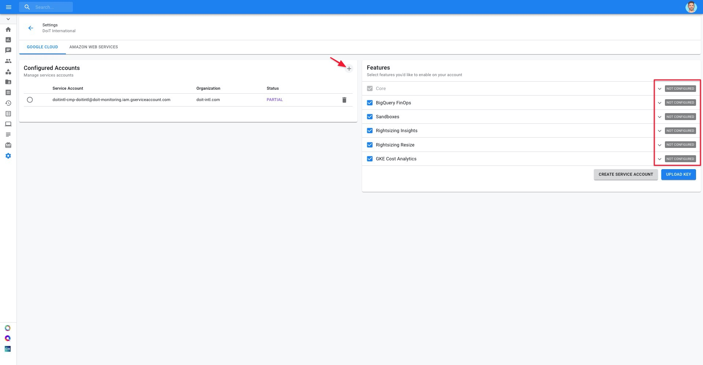

# Connect Your Google Cloud IAM

In order to use many of the functionalities available to you within the **Cloud Management Platform**, we request an extra set of permissions, depending on the features you'd like to use. These permissions allow us to access the Google API and obtain information for monitoring or alerts, and/or help you take action on recommendations.

To grant these permissions, you will need to create a Google Cloud Service Account, set up a Google Cloud IAM Role at the organization level, and upload the key to the Cloud Management Platform. In this article, we'll go over how to do all of the above.

**Required Permissions:**

At a minimum, to connect your Google Cloud Organization, you must be granted the following CMP permissions:

* Manage Settings

## Creating a Google Cloud Service Account 

To create a service account, please execute the following steps:

1. Navigate to the Settings icon in your lefthand navigation panel
2. Check the features you'd like to enable within the CMP
3. Review the permissions each service request \(by expanding the card\)
4. Click on "Create Service Account"

Next, a slide-out will appear on the right side of your screen, containing all of the Google SDK \([gcloud\)](https://cloud.google.com/sdk) commands you need to run in order to create the service account and set it up with the correct role. Copy the commands and run them sequentially in your terminal or Google Cloud Shell.

_**Note:** The gcloud commands vary according to the boxes of the features you checked._

Once finished, you should have the JSON file of your service account.

## Upload your Service Account Key

Whether you've generated your service account key via Google Cloud Console or CMP, your next step is to upload the JSON file in the CMP by clicking on "Upload File".

If configured successfully, you should see a "**Healthy**" or "**Partial**" value appear under the "Status" column in the "Configured Accounts" widget.

"**Partial**" will only appear next to your configured service account if you didn't grant permissions for _all_ of the available features. What's important in this case is to examine the "Features" widget and verify that all of the features you selected have a "**Healthy**" status.

If there is something wrong with the JSON file you uploaded, you will see an "**Unhealthy**" value under the "Status" column. 

## Updating your Service Account

If, after initially connecting your Google Cloud Organization, you decide that you want to grant permissions for an additional feature — or remove permissions — you can do that easily from the CMP. First, check or uncheck the feature\(s\) you'd like to add or remove. Then click on "Update Role".

A slide-out will appear containing the gcloud commands you need to run to update your service account's role so that permissions corresponding to the feature you checked or unchecked are added or removed, respectively.

## Adding Multiple Service Accounts

In the very rare event that you have multiple Google Cloud Organizations, you can upload multiple service account keys to regulate which Organizations get access to which features.

To add a new service account, click on the **"+"** icon in the top-right corner of the Configured Accounts widget. 

Once clicked, notice that all of the Features will revert back to "Not Configured" since you are setting up a new service account.

As you did with your initial service account, select the features you'd like to grant permissions for this service account, and run the gcloud commands provided.

