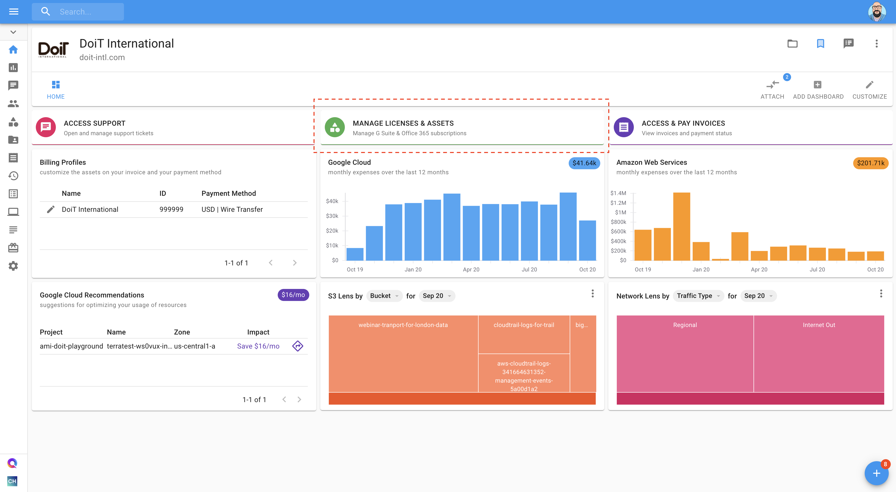

# Create Google Billing Account

### Overview

The _Cloud Billing accounts_ are used to define who pays for a given set of Google Cloud resources and _Google Maps Platform APIs_. Access control to a Cloud Billing account is established by IAM roles. A Cloud Billing account is connected to a DoiT International [billing profile](../invoices-and-payments/setting-up-a-new-billing-profile.md).

Use these instructions to create a Google Cloud Billing Account and link it to your company's billing profile using the Cloud Management Platform. 


Required Permissions**:** _Assets Manager_



Please note: Your user account must be linked to at least one billing profile in the _Cloud Management Platform_.


### Create a new Billing Account

Start with you logging into the [Cloud Management Platform](https://app.doit-intl.com), and select _Manage Licenses & Assets_ from the main dashboard:

Once you're at the Assets page, switch to the Google Cloud tab and select _New Billing Account_, located on the right-hand side of the page. 

You will be prompted with a pop-up requesting you to enter your Google _Billing Account Name_, _Billing Profile_, and the email addresses of designated _Billing Account Administrators_. 

After a few seconds, you should now see the new billing account:


Your domain is added as a _Billing Account User_ on the new Billing Accounts you create in thr CMP. This allows anyone on the domain to link projects to the billing account.


## 

The following video shows you how to create a Google Cloud Billing Account.



