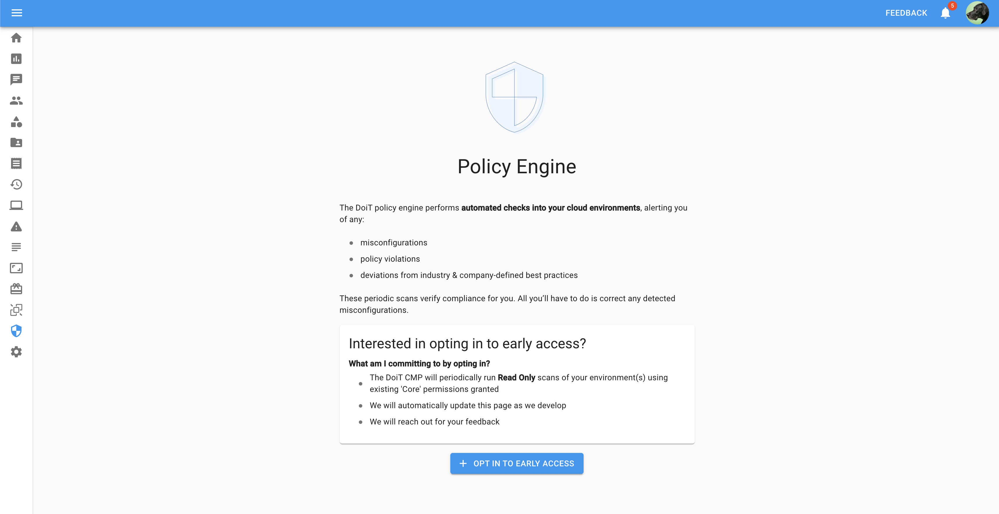

# Policy Engine Early Access

## Overview

The DoiT Policy Engine is a new core feature in our CMP.  It's goal is to provide an automated, flexible set of rules that can be run against a your cloud environments. By automating industry standard and benchmarks, you can always be sure that your environments are configured according to best practice.  Overtime we expect this engine to grow to support a wide range of use-cases including: tag compliance and enforcement, cost waste reduction, security auto remediation, and more.

The initial release is focused on providing out of the box value - a simple preset experience that leverages a recognized industry best practice.  These presets will leverage CIS Foundations benchmarks for GCP and AWS as an initial policy set.  In the future this will grow to include additional standards from the industry as built-in policy packs.  In addition, customers will have the ability to define custom rules to catch more specific rules and scenarios for their business.

## Capabilities

* Scheduled Recurring Checks against current CIS Benchmarks for AWS and GCP
  * CIS AWS Foundations Benchmarks 1.2.0
  * CIS GCP Foundations Benchmarks 1.2.0
* Filterable Dashboard UI sorted by violation severity
* Actionable result to allow immediate remediation
* Read-only Rule set to inspect what is being run

### Early Access

If you would like to join the Early Access Program, navigate to the Governance Area and 'Opt-in' to include your company in the program.

Opting in Requires the preset 'Admin' Role in the CMP

### Requirements for Access

* You must have **Core Permissions** enabled for your GCP Organization, or your AWS Accounts.
* Explicit permission (granted via opting in) for DoiT to run Read Only scans of your environment based on the rules mentioned above
  * These checks are passive and make no changes to your environment
  * API requests will be seen within account logs
* Willingness to provide feedback based on early access to reports, dashboards, and UI mocks to help focus and validate releases.
