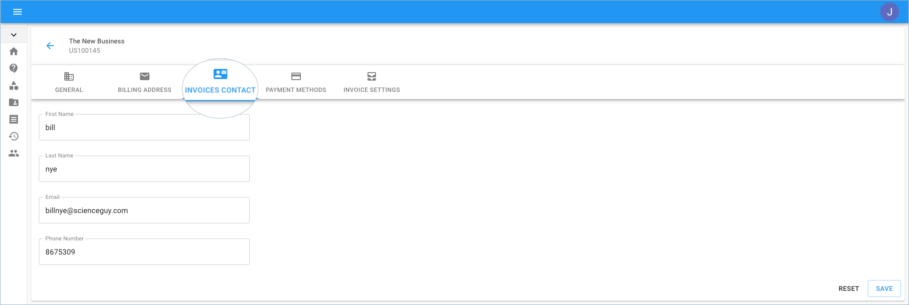

# Set Accounts Payable Contact

You can update the Accounts Payable information for your organization using the Cloud Management Platform. The information is used for billing and invoicing purposes.


Required Permissions: **Billing Profile Admin**



Please note that you must be assigned access to the specific Billing Profile under which the domain is managed in order to purchase a license.


From the main dashboard, click on the edit icon next to the Billing Profile of which you want to update.

 (4) (1) (4).png>)

Once you're at the Billing Profile Settings page, switch to the 'Invoices Contact' tab.

Once you're finished updating your details, go to the bottom right-hand corner of the page and click Save.

The following video shows you how to update the AP information for a billing profile.


