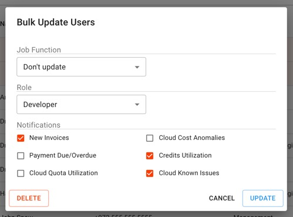

# Creating a New User

You can manage the access of other users on behalf of the organization, as well as create users for new employees who need access to the Cloud Management Platform.


Required Permissions: **User Manager**


### Inviting new users

Please select the '**Users and Roles**' icon on the left-hand navigation panel.

Next, click the "Invite User" button on the right side of the page.

Enter the email(s) of the colleague(s) you'd like to invite to your team. If you want to continue on to edit their profile settings, check the "Continue to editing user profile" box.

The recipient(s) you invited will receive an email, which you will be cc'd on, inviting them to complete the sign up and use the CMP.

### Editing User Profiles

There are two ways you can access the page to edit a user's profile:

* Check the "Continue to editing user profile" box when initially inviting them.
* Click on their email in your Users list.

When editing a profile, you have four sections:

1. **Profile** - Set name, job function, and phone number of the user
2. **Permissions** - [Assign a role](manage-roles.md) to the user, which contains the [set of permissions](user-permissions-explained.md) they have.
3. **Notifications **- Determine which events you'd like the user to be notified on.
4. **API **- [Generate an API key](https://developer.doit-intl.com/docs/start) that lets you programmatically access CMP features.

#### **Bulk Editing**

To perform bulk updates on users in your organization, check the boxes next to the users you'd like to update. Next, click on the "Edit" button.

****

In the "Bulk Update Users" pop-up, make your bulk changes. This can include updating multiple users' job function, role, and/or notifications.

Once you've made your desired changes, click on the "Update" button to confirm them.

You may also bulk delete users from your organization. Simply click on the "Delete" button and confirm your decision after.

**Notification Types:**

* _New Invoices_ - Get sent an email when a new invoice is uploaded to the Cloud Management Platform.\

* _Cost Anomalies_ - Get notified when our system detects abnormal usage of your cloud platform (i.e., AWS or Google Cloud)\

* _Payment Due/Overdue_ - Get automated updates when your invoices are becoming due and when they're overdue.\

* _Credit Alerts_ - request to be notified when your credits are nearly exhausted (75% utilization), and once again when they've been exhausted.\

* _Cloud Quota Utilization - _Get alerted when your Google Cloud and/or AWS service quota utilization exceeds 80%.\

* _Cloud Known Issues - _Get notified when there are any [known infrastructure issues](../tickets/cloud-infrastructure-known-issues.md) with Google Cloud and/or AWS.

