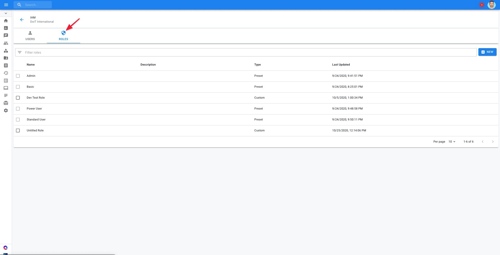

# Creating User Roles

Users Roles make it easy to bulk-assign permissions when [adding new users](creating-a-new-user.md) to your organization in the CMP. 


Required Permissions: **User Manager**


To create a custom user role, select the "Users and Roles" icon in the lefthand navigation bar.

From there, navigate to the "Roles" tab. You will see a list of Preset Roles, as well as any other Custom Roles created by your team.

Create a new role by clicking on the "**+ NEW** " button at the top right of the screen. This opens a new page with a [list of permissions](user-permissions-explained.md) available to group into the new role.

To get started:

1. Give your new User Role a good name.
2. _**Optional:**_ Give the role a description to give additional context around who the role is for.
3. Select the permissions you'd like the role to contain.

### Editing a User Role

To modify the permissions contained in a role, check the box next to the role you'd like to edit, then click on the "Edit Role" icon at the top-right of your screen.

From there, make your edits to the permissions the role contains. When finished, click on the **&lt;--** back arrow icon at the top-left to return to the main Roles page.

